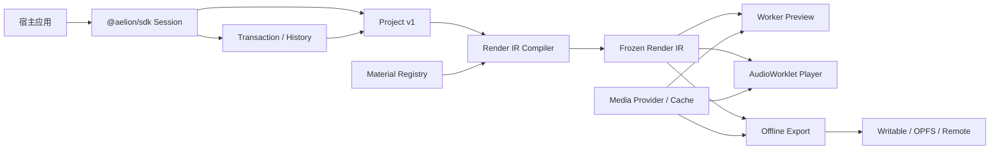
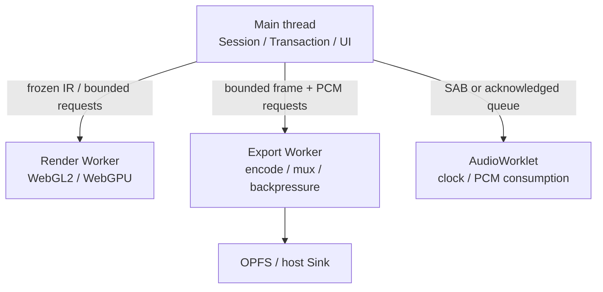

这篇文档面向需要排查引擎问题、开发底层扩展或评估运行成本的开发者。普通产品接入不必先读完；先完成[快速开始](/AelionSDK/start/getting-started/)会更容易理解下面各层的作用。

从应用视角看，入口只有 Session：加载 Project，提交编辑，获取预览、播放和导出。Session 内部再把持久化数据、编辑状态和执行资源拆开管理。

## 系统视图



### Project：可以保存的工程数据

Project 是规范化的 JSON snapshot。实体以稳定 ID 存储，关系通过 ID 引用，顺序通过明确的 ID 数组表达。它适合保存、同步、diff 和迁移，不保存实时命令、文件对象和运行时缓存。

Project 的机器可读定义位于 [`schemas/project/v1`](https://github.com/FoyonaCZY/AelionSDK/blob/main/schemas/project/v1/project.schema.json)。加载时先复制成 SDK 自己持有的纯 JSON，再检查 Schema、引用、时间和执行条件。不可信输入在进入 Ajv 前还会限制深度、节点数、数组长度、对象属性数和字符串字节，避免一个异常大对象先耗尽页面资源。

### Transaction：修改工程的唯一入口

所有 Project 变化通过 Transaction 提交。一次提交产生：

- 新 revision；
- 原子 operations 与 inverse；
- affected entity IDs 和 sequence ranges；
- 用于 observer、Preview 和缓存失效的 ChangeSet。

校验、IR preparation 或 observer 重入失败时，不发布部分 Project、history 或 Render IR。领域命令编译为 Transaction，而不是建立第二套 Timeline 模型。

### Render IR：给预览和导出共用的执行图

Render IR 是从有效 Project 编译出的内部、可冻结执行图。它解析引用、默认值、时间映射、轨道参与规则、Material program 和资源需求。导出启动后持有 frozen IR，因此编辑可以继续进行，但不会改变当前输出。

Preview、Player 和 Export 复用相同的时间映射、关键帧求值、画面合成和音频混音逻辑。WebGL2、WebGPU 和编码器负责执行这些结果，不会各自重新解释 Project。

## 线程与资源



- 主线程持有公开 Session、Project snapshot、Transaction 和宿主回调。
- Render Worker 持有 GPU context、pipeline、texture 和有界 frame queue。
- AudioWorklet 以实际 PCM 消费进度驱动主时钟；无隔离环境使用 acknowledged Transferable queue。
- Export Worker 负责可用 profile 的 encoder orchestration、mux 和 Sink 背压。
- `PageMediaResourceGovernor` 在多个 Session 间仲裁 decoder、GPU 和 cache 预算。

每一种跨线程资源都有 owner、generation、上限、取消和释放路径。过期 response 不能重新进入当前 generation。

## 时间与媒体

- API 时间单位是整数微秒，帧率是有理数。
- SampleIndex 区分 presentation order 和 decode order；exact seek 从同步样本开始解码，并按冻结策略选择目标帧。
- 原始容器字段只在 adapter 能证明其语义时暴露，不用估算值伪装 raw DTS 或 physical offset。
- MediaProvider 负责资产绑定和数据访问；demux、decode、cache、proxy 与资源治理位于媒体层。
- 音频和视频通过同一 sequence/source time mapping 求值，避免 seek、Preview 和 Export 各自漂移。

## 渲染与颜色

视觉轨道按 Project 顺序执行 premultiplied alpha composition。Material Graph 在编译期完成类型、拓扑、budget 和 backend requirement 校验。WebGL2 与 WebGPU 使用共同的 node/blend 语义；后端缺失时只能按 capability policy 回退或拒绝。

IR 明确携带 working color space、transfer function 和 bit-depth contract。当前 surface 和编码链只承诺 RGBA8 SDR；无法满足的 HDR contract 在创建昂贵资源前失败。

## 音频与播放

有声播放以 AudioContext/AudioWorklet 为主时钟。视频 scheduler 可以丢弃过期帧，但不能让 UI wall clock 反向驱动声音。seek 会提升 generation、清空 PCM 并丢弃旧音视频结果。

离线 Export 复用同一个 mixer 和 sample-time evaluator，只把实时消费替换为确定性的离线 block 调度。

## 导出

```text
preflight
  → freeze Project revision / Render IR
  → offline frame & sample schedule
  → render / mix
  → encode
  → streaming mux
  → bounded Sink
  → optional independent readback
```

Profile 不会被静默替换。Preflight 在创建 encoder、GPU 或大文件前检查 codec、backend、Material、Sink 和颜色契约。每一级传播 AbortSignal 和背压，失败或取消时清理 partial output。

## 关键设计决策

过去分散的 ADR 已收敛到这里。以下规则仍是现行架构约束：

| 决策             | 结论                                                             |
| ---------------- | ---------------------------------------------------------------- |
| Project 与命令流 | JSON 是 snapshot；实时编辑由 Transaction 表达                    |
| 时间             | 公开协议使用整数微秒和有理帧率                                   |
| 数据模型         | 实体 normalized，顺序通过 ID list 表达                           |
| 执行语义         | Preview 与 Export 共用 Render IR                                 |
| 平台能力         | backend、codec、storage 由 capability 和 preflight 选择          |
| 播放时钟         | 有声播放以 AudioWorklet 为主时钟                                 |
| 导出             | 离线逐帧/逐 sample，流式写入并传播背压                           |
| 安全             | Project 不携带任意可执行代码                                     |
| 媒体             | 容器能力通过 adapter 和 SampleIndex 显式门控                     |
| 公共 API         | 应用优先使用 Session facade，底层包保持可组合                    |
| 分发             | 多包发布，以真实 tarball consumer 验证入口和 runtime assets      |
| 合成             | 多层画面使用 premultiplied alpha 语义                            |
| Material 信任    | 确定性 package、精确 integrity、签名和宿主 execution policy 分离 |
| 生产执行         | frozen IR、资源仲裁、可取消队列和 capability-selected backend    |

改变这些约束需要同时更新 Schema/类型、测试、迁移、兼容性和本页，而不是只修改某个 backend。

## 模块边界

| 模块              | 责任                                                                |
| ----------------- | ------------------------------------------------------------------- |
| `project-schema`  | 持久化类型、Schema、canonical、validation                           |
| `transaction`     | operation、领域命令、revision、history、affected ranges             |
| `render-ir`       | Project 编译、时间/动画求值、共享节点语义                           |
| `media`           | range、demux、SampleIndex、seek/decode、cache/proxy/governor        |
| `renderer-worker` | GPU backend、compositor、字体和 frame ownership                     |
| `audio`           | mixer、processor、AudioWorklet、设备状态                            |
| `export`          | profile、preflight、scheduler、encode、mux、Sink、remote/checkpoint |
| `material-*`      | Material 协议、编译、创作、信任和工具                               |
| `sdk`             | 生命周期、公开 facade、事件、诊断和模块编排                         |

更细的公开类型以各 package `src/index.ts` 和 [SDK API Snapshot](https://github.com/FoyonaCZY/AelionSDK/blob/main/packages/sdk/api-snapshot.md) 为准。
