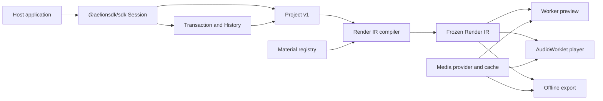

Most applications only need the public `Session` API. This page explains the layers below it for
engine contributors, custom hosts, and production debugging.

## System view

```mermaid
flowchart LR
  Host["Host application"] --> SDK["@aelionsdk/sdk Session"]
  SDK --> Project["Project v1"]
  SDK --> Tx["Transaction and History"]
  Tx --> Project
  Project --> Compiler["Render IR compiler"]
  Materials["Material registry"] --> Compiler
  Compiler --> IR["Frozen Render IR"]
  IR --> Preview["Worker preview"]
  IR --> Player["AudioWorklet player"]
  IR --> Export["Offline export"]
  Media["Media provider and cache"] --> Preview
  Media --> Player
  Media --> Export
```

### Project: persistent data

Project v1 is canonical JSON. It owns assets, sequences, tracks, items, link groups, markers,
materials, settings, and project metadata. It stores stable media identities, never `File`,
decoder, GPU, or DOM objects.

### Transaction: the only editing boundary

Semantic commands and low-level transactions validate a complete candidate Project before
committing it. A commit increments the revision and produces a change set. Failed commands leave
the Project and history unchanged; undo and redo use the same validation boundary.

### Render IR: one execution graph

The compiler resolves references, time mapping, materials, color, and audio into immutable Render
IR. Preview, playback, local export, and remote export consume the same semantics. Preview may use
proxies or adaptive quality, but must not invent a different timeline interpretation.

## Threads and resources

The main thread owns Session state and product interaction. Renderer and export workers own their
GPU/encoder resources; AudioWorklet owns the playback clock. Transferable objects cross a boundary
once, and every frame, decoder, writer, object URL, worker, and worklet has an explicit owner.
Cancellation is propagated with `AbortSignal`; disposal is idempotent.

## Time and media

Timeline time uses safe integer microseconds and rational frame rates. The Project stores asset
IDs; a `ProductionMediaProvider` binds those IDs to File, URL, OPFS, proxy, or custom byte sources.
Container indexing and range reads make random access possible without loading an entire file.

## Rendering, color, and audio

Visual evaluation produces frames in the IR working-space contract before compositing. Unsupported
HDR or backend requirements fail explicitly instead of silently changing output. Audio is mixed
from the same timeline mapping, and playback uses the audio clock as the timing authority when
audio is active.

## Export

Export freezes a revision and its Render IR, runs an exact preflight, renders offline, encodes,
muxes, and finalizes a caller-owned sink. A later edit does not mutate a running job. Partial
outputs are cleaned up or resumed only through an explicit checkpoint contract.

## Module boundaries

Applications should start with `@aelionsdk/sdk`. The lower-level packages expose Project
validation, transactions, media, Render IR, rendering, audio, capabilities, materials, and export
for advanced hosts. See [Packages and public entry points](/AelionSDK/reference/packages/).
