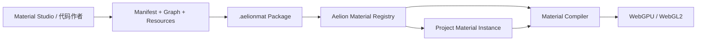

# Aelion Material Protocol v1

| 项目     | 内容                                     |
| -------- | ---------------------------------------- |
| 协议     | Aelion Material Protocol，简称 AMP       |
| 版本     | 1.0.0 Draft                              |
| 日期     | 2026-07-10                               |
| 状态     | Alpha 实现协议；尚未形成 1.0 兼容承诺    |
| 适用范围 | 视觉滤镜、视觉特效、视觉转场、视觉生成器 |

## 0. 结论

AelionSDK 把 Material 作为一等能力开放给上层。上层可以制作、预览、打包和安装 Material，而无需修改 AelionSDK 内核。

协议分成四层：

1. **Material Package**：可分发的 `.aelionmat` 包，包含清单、定义、图、资源和可选的受信任程序实现。
2. **Material Definition**：一个滤镜、特效、转场或生成器的稳定定义，包括端口、参数、资源和执行契约。
3. **Material Graph**：安全、声明式、可视化编辑的 DAG，由 Aelion 标准节点组成，可编译到 WebGPU/WebGL2。
4. **Material Instance**：项目中对 Definition 的一次引用，保存参数关键帧、资源绑定和辅助输入绑定。



最重要的边界是：

> Project JSON 可以引用 Material，但不能携带或自动执行任意 JavaScript、WGSL、GLSL 或 WASM。声明式 Graph 可以按安全策略动态安装；包含程序代码的包只能由宿主显式信任和注册。

这套设计同时支持：

- 上层搭建无代码 Material 编辑器；
- 业务团队从 JSON Graph 制作大多数转场、滤镜和特效；
- 高级团队用 Shader/WASM 实现复杂、多 Pass 或音频能力；
- 同一个 Material 在 WebGPU、WebGL2、预览和导出间保持统一语义；
- Material 商店、版本锁定、签名、灰度和回滚；
- AelionSDK 内核无需为每个新效果新增特殊 Item/Segment 类型。

---

## 1. 术语与边界

### 1.1 Material Definition 与 Material Instance

两者必须分开：

| 对象                | 存放位置                | 内容                                           |
| ------------------- | ----------------------- | ---------------------------------------------- |
| Material Definition | `.aelionmat` 包         | 端口、参数 Schema、Graph、资源、实现和能力声明 |
| Material Instance   | Aelion Project Document | 精确版本引用、参数值/动画、资源和辅助输入绑定  |

Definition 类似“效果类”，Instance 类似“项目里应用的一次效果”。同一个 Definition 可以产生任意多个 Instance，各自拥有独立参数。

### 1.2 Material 与插件

- **Material** 是面向创作者和项目的视觉能力单位。
- **Material Package** 是其分发单位。
- **Plugin** 是更高权限的宿主扩展，可注册自定义 Graph Node、Shader/WASM backend、Resolver 等。

纯 Graph Material 不需要编写 Plugin。只有标准 Graph 无法表达时，才需要受信任的程序实现或 Plugin。

### 1.3 协议不负责的内容

- Material 商店的账号、支付和推荐；
- 素材版权自动判断；
- 浏览器端代码或资源的绝对保密；
- 任意第三方 Shader 的安全执行承诺；
- UI 编辑器的具体框架和布局。

签名可以证明完整性和发布者身份，但浏览器下载到本地的 Shader、图和资源最终都可被用户检查。真正需要保密的算法必须留在服务端渲染链，不能依靠前端加密假装保密。

---

## 2. Material 分类与强制契约

### 2.1 分类

| kind                | 主输入                           | 系统输入             | 输出         | 用途                               |
| ------------------- | -------------------------------- | -------------------- | ------------ | ---------------------------------- |
| `visual-filter`     | `source` 1 个                    | 时间、画幅、UV       | visual-frame | LUT、调色、颗粒、局部色彩处理      |
| `visual-effect`     | `source` 0 或 1 个，可有辅助输入 | 时间、画幅、UV       | visual-frame | 模糊、光效、故障、位移、抠像、叠加 |
| `visual-transition` | `from`、`to` 各 1 个             | `transitionProgress` | visual-frame | 两个片段之间的转场                 |
| `visual-generator`  | 无主输入，可有资源               | 时间、画幅、UV       | visual-frame | 纯色、渐变、粒子、程序纹理、背景   |

后续协议可以沿用相同 Package/Parameter 体系加入 `audio-effect` 和 `audio-transition`，但 AMP 1.0 的可移植声明式 Graph 先以视觉能力为正式基线。

### 2.2 Filter 不是营销标签

`visual-filter` 必须满足：

- 只有一个主视觉输入；
- 输出尺寸与输入一致；
- 不改变几何位置和有效边界；
- 不依赖其他时间帧；
- 不引用其他 Item/Track 输出；
- 可以由编译器与相邻逐像素节点融合。

需要邻域采样、空间扩边、多输入、历史帧或几何位移时，应声明为 `visual-effect`。严格分类让运行时可以可靠优化，而不是根据名称猜测。

### 2.3 Transition 契约

`visual-transition` 固定获得：

- `from`：前一个 Item 在当前 Sequence 时间的已渲染视觉输出；
- `to`：后一个 Item 在当前 Sequence 时间的已渲染视觉输出；
- `transitionProgress`：规范化进度 `[0, 1]`；
- 当前输出尺寸、工作色彩空间和帧上下文。

Item 自身 Material 链先执行，Transition 再消费两个结果，随后进入 Track Material 链。Transition 不直接访问 Timeline、解码器或原始文件。

由于 Transition 区间使用半开区间，最后一个采样帧的 progress 可能小于 1；Transition 结束后的下一帧直接显示 `to`。Material 必须在 `progress → 1` 时连续趋近纯 `to`，在 `progress = 0` 时输出纯 `from`，除非 Definition 明确声明设计性 endpoint deviation，并因此不能作为通用转场。

### 2.4 Effect 契约

`visual-effect` 可以声明：

- 一个可选或必选 `source`；
- 其他 visual-frame、mask、depth、motion-vector 辅助端口；
- 空间 padding；
- 有界的过去/未来时间窗口；
- 多 Pass；
- bundled resource 或项目 Asset slot。

所有依赖必须显式声明。Material 不能在执行时自行遍历项目或请求任意 Timeline 节点。

### 2.5 Generator 契约

Generator 没有隐含 `source`，通过 Material Content Item 放在时间线上。它使用 Item range 提供的 local time 和 duration，可输出透明画面或完整背景。

---

## 3. 两级创作模型

### 3.1 Declarative Graph：默认级别

适合绝大多数上层和 Material Studio：

- 只包含 JSON Graph、参数和静态资源；
- 只能调用 Aelion 标准 Node Registry 中的节点；
- 无循环、递归、任意文件访问、网络、DOM 或 JavaScript；
- 编译器可以静态推导类型、Pass、时间窗口、空间 padding 和成本；
- 可根据节点支持情况编译到 WebGPU 和 WebGL2；
- 通过 Schema、语义校验和配额后，可以由应用动态加载。

### 3.2 Trusted Programmable：高级级别

适合标准 Graph 无法表达的算法：

- WGSL Shader Pipeline；
- GLSL ES 3.0 fallback；
- CPU/WASM 实现；
- 自定义 Graph Node Plugin。

此类包即使签名也不能自动获得信任。宿主必须通过 allowlist、内置清单或用户明确授权安装：

```ts
await sdk.materials.install(source, {
  trust: 'trusted-code',
  expectedPublisher: 'com.example.media',
  expectedIntegrity: 'sha256:...',
});
```

### 3.3 为什么不只提供 Shader

只提供 Shader 会造成：

- 上层难以搭建无代码编辑器；
- WebGPU 与 WebGL2 要维护两份实现；
- 参数、资源、时间、颜色和透明度没有统一语义；
- 难以静态计算性能与依赖；
- 难以安全加载第三方 Material；
- 多 Pass、辅助输入和降级行为各自为政。

Graph 是大多数 Material 的标准源语言，Shader 是明确受信任的逃生舱。

---

## 4. Material Package

### 4.1 目录结构

开发阶段使用普通目录；发布时打成标准 ZIP，扩展名 `.aelionmat`：

```text
starter-pack.aelionmat/
├── manifest.json
├── materials/
│   ├── warm-film.material.json
│   ├── cross-zoom.material.json
│   └── light-leak.material.json
├── graphs/
│   ├── warm-film.graph.json
│   ├── cross-zoom.graph.json
│   └── light-leak.graph.json
├── resources/
│   ├── grain.webp
│   └── cinematic.cube
├── shaders/                  # 仅 trusted-code 包可有
│   ├── effect.wgsl
│   └── effect.glsl
├── wasm/                     # 仅 trusted-code 包可有
│   └── effect.wasm
├── previews/
│   ├── thumbnail.webp
│   └── preview.mp4
├── locales/
│   ├── zh-CN.json
│   └── en-US.json
├── LICENSES.json
└── signature.json            # 可选
```

### 4.2 打包规则

- `manifest.json` 必须位于根目录。
- 路径必须是规范 UTF-8 相对路径，不允许空 segment、`.`/`..` segment、尾随 `/`、NUL、绝对路径、反斜杠和符号链接。
- ZIP 不允许嵌套加密、可执行入口或解压后逃逸目录。
- 所有 payload 文件必须出现在 manifest 的 `files` 中，不允许未声明文件。
- `manifest.json` 和 `signature.json` 不进入 `files`，避免自引用 hash。
- 发布构建按路径字典序写入并固定时间戳，保证可重复打包。
- 默认限制：包含 `manifest.json` 最多 256 个文件、canonical manifest 256 KiB、全部文件合计 64 MiB、单资源 32 MiB、确定性 ZIP 65 MiB；宿主可以收紧。限制必须在字节复制、hash、ZIP 重建或外部 archive 解压分配之前执行。
- v1 不支持包依赖树。Material 只能依赖指定版本的 Aelion Core Node Set，避免供应链和菱形依赖问题。

### 4.3 Manifest 示例

```json
{
  "$schema": "https://schemas.aelion.dev/material/package/v1.json",
  "protocolVersion": "1.0.0",
  "package": {
    "id": "dev.aelion.example.starter-pack",
    "version": "1.0.0",
    "displayName": "Aelion Starter Materials",
    "publisher": {
      "id": "dev.aelion.example",
      "name": "Aelion Examples"
    },
    "license": "MIT",
    "engines": {
      "aelion": ">=1.0.0 <2.0.0",
      "nodeSet": "aelion.visual.nodes/1.0.0"
    },
    "trust": "declarative"
  },
  "materials": [
    {
      "id": "warm-film",
      "kind": "visual-filter",
      "definition": "materials/warm-film.material.json"
    }
  ],
  "files": [
    {
      "path": "materials/warm-film.material.json",
      "mediaType": "application/vnd.aelion.material+json",
      "bytes": 1234,
      "sha256": "0123456789abcdef0123456789abcdef0123456789abcdef0123456789abcdef"
    }
  ]
}
```

同一 package 内 `material.id` 唯一。Material 的完整身份为：

```text
package.id + package.version + material.id + package integrity
```

Project 必须锁定精确 package version 和 integrity，不能使用 `latest` 或 semver range。

### 4.4 Integrity 与签名

1. 每个 payload 在 manifest 中保存 SHA-256。
2. manifest 使用 RFC 8785 JCS 规则 canonicalize。
3. `packageIntegrity = "sha256:" + lowercaseHex(SHA-256(JCS(manifest)))`。
4. 可选 `signature.json` 使用发布者 Ed25519 key 对 SHA-256 的原始 32 bytes 签名。

```json
{
  "algorithm": "Ed25519",
  "publisherId": "dev.aelion.example",
  "keyId": "release-2026-01",
  "packageIntegrity": "sha256:0123456789abcdef0123456789abcdef0123456789abcdef0123456789abcdef",
  "signatureBase64": "..."
}
```

签名只解决身份与篡改，不自动授予 trusted-code 权限。Registry 可以要求签名，私有业务也可以只使用固定 integrity allowlist。

---

## 5. Material Definition

### 5.1 顶层模型

```ts
interface MaterialDefinition {
  protocolVersion: '1.0.0';
  id: string;
  kind: 'visual-filter' | 'visual-effect' | 'visual-transition' | 'visual-generator';
  display: MaterialDisplay;
  scopes: Array<'source' | 'item' | 'track' | 'sequence' | 'transition'>;
  ports: MaterialPort[];
  parameters: MaterialParameter[];
  bundledResources: BundledResource[];
  resourceSlots: ResourceSlot[];
  execution: MaterialExecutionContract;
  implementations: MaterialImplementation[];
  splitPolicy: 'copy' | 'reset' | 'reject';
}
```

Definition 是纯数据。其 ID、端口 ID、参数 ID 和资源 ID 发布后不能在同一 major 中改变含义。

### 5.2 Display 元数据

```ts
interface MaterialDisplay {
  name: string;
  description?: string;
  category?: string;
  tags?: string[];
  icon?: string;
  thumbnail?: string;
  preview?: string;
  localizationPrefix?: string;
}
```

Display 只影响素材面板和编辑器，不参与渲染和 cache key。路径必须指向包内已声明文件。

### 5.3 Scope

- `source`：在源方向/颜色规范化后、裁剪和空间变换前执行。
- `item`：在 Item 本地视觉空间执行。
- `track`：对已合成 Track 结果执行。
- `sequence`：对最终 Sequence 画面执行。
- `transition`：只能被 Transition 实例引用。

Definition 声明允许范围，Instance 的实际宿主必须属于其中之一。一个只适合全屏的后处理不能被错误挂到 source domain。

---

## 6. 端口与输入绑定

### 6.1 Port

```ts
interface MaterialPort {
  id: string;
  direction: 'input' | 'output';
  type: 'visual-frame' | 'mask' | 'depth' | 'motion-vectors';
  role: 'source' | 'from' | 'to' | 'auxiliary' | 'result';
  binding: 'host' | 'instance';
  required: boolean;
  description?: string;
}
```

- `host` 端口由 SDK 自动提供，例如 filter 的 source、transition 的 from/to。
- `instance` 端口由项目 Material Instance 显式绑定，例如位移贴图或外部遮罩。
- v1 每端口 cardinality 固定为 one；多个输入需要声明多个稳定端口。
- 所有引用都会进入 Render IR 依赖图，循环引用在项目校验阶段拒绝。

### 6.2 各 kind 的必需端口

| kind              | 必需输入                         | 必需输出               |
| ----------------- | -------------------------------- | ---------------------- |
| visual-filter     | `source`: visual-frame、host     | `result`: visual-frame |
| visual-effect     | 按 Definition，可有 `source`     | `result`: visual-frame |
| visual-transition | `from`、`to`: visual-frame、host | `result`: visual-frame |
| visual-generator  | 无                               | `result`: visual-frame |

端口约束不仅由 JSON Schema 校验，还由 Material semantic validator 按 kind 校验。

### 6.3 项目中的辅助输入绑定

```json
{
  "inputBindings": {
    "displacement": {
      "type": "item-output",
      "itemId": "item_displacement_map",
      "time": "same-sequence-time",
      "boundary": "transparent"
    },
    "matte": {
      "type": "asset",
      "assetId": "asset_mask"
    }
  }
}
```

可绑定来源：

- 项目 Asset；
- 另一个 Item 的视觉输出；
- Track 输出；
- Nested Sequence 输出；
- 协议定义的常量 frame/mask。

绑定必须类型兼容。依赖图有环、引用自身处理后的输出或跨越非法 Sequence 边界时拒绝提交。

---

## 7. 参数协议

### 7.1 参数类型

AMP v1 支持：

| type                     | canonical JSON            | 典型用途                        |
| ------------------------ | ------------------------- | ------------------------------- |
| `boolean`                | boolean                   | 开关                            |
| `integer`                | number safe integer       | 采样数、模式索引                |
| `float`                  | finite number             | 强度、比例                      |
| `enum`                   | string                    | 模式选择                        |
| `vec2` / `vec3` / `vec4` | `{x,y,...}`               | 方向、中心、向量                |
| `color`                  | `{space, rgba}`           | 颜色                            |
| `angle`                  | number，单位 degree       | 旋转方向                        |
| `duration`               | safe integer microseconds | 周期、延迟                      |
| `gradient`               | ordered color stops       | 光效、渐变                      |
| `curve`                  | ordered control points    | 响应曲线                        |
| `string`                 | string                    | 只用于非 Shader 文本/标签类节点 |

### 7.2 Parameter Schema

```json
{
  "id": "intensity",
  "type": "float",
  "default": 0.65,
  "range": {
    "min": 0,
    "max": 1,
    "softMin": 0,
    "softMax": 1,
    "step": 0.01
  },
  "unit": "ratio",
  "animatable": true,
  "interpolation": "linear",
  "affects": "uniform",
  "ui": {
    "control": "slider",
    "group": "look",
    "order": 10,
    "label": "Intensity"
  }
}
```

### 7.3 参数规则

- `id` 是渲染语义的一部分，发布后不能改名而不迁移。
- 所有数值必须 finite，运行时拒绝 NaN/Infinity。
- `range.min/max` 是硬约束；soft range 只影响 UI。
- `affects = uniform` 可以逐帧动画，不需要重编 pipeline。
- `affects = specialization` 可能选择 pipeline variant，不能逐帧动画。
- `affects = graph` 会改变图结构，只能在事务提交时修改，不能 animatable。
- 颜色参数明确插值空间；默认在线性工作空间插值。
- angle 默认数值插值；需要最短路径时写 `interpolation = shortest-angle`。
- duration 使用整数微秒，不使用浮点秒。
- enum 保存稳定 value，不保存本地化 label。
- UI 元数据不参与渲染结果，Material Studio 可自动生成面板。

### 7.4 参数约束

跨参数约束采用受限的声明式条件，不允许 JavaScript 表达式：

```json
{
  "constraints": [
    {
      "when": { "parameter": "mode", "equals": "radial" },
      "require": { "parameter": "samples", "max": 32 }
    }
  ]
}
```

AMP v1 只支持等值、范围、all/any/not 等有限操作。复杂派生值应在 Graph 中计算，不应隐藏在 UI 表达式里。

---

## 8. 资源协议

### 8.1 Bundled Resource

跟随包发布且不可由项目替换：

```json
{
  "id": "grain",
  "kind": "texture2d",
  "path": "resources/grain.webp",
  "mediaType": "image/webp",
  "colorSpace": "srgb",
  "alpha": "straight",
  "sampling": {
    "filter": "linear",
    "addressU": "repeat",
    "addressV": "repeat",
    "mipmaps": true
  }
}
```

支持的资源 kind：

- texture2d；
- texture3d / LUT3D；
- LUT1D；
- cube texture；
- mask；
- binary uniform table；
- 后续 audio impulse extension。

资源进入 GPU 前由 SDK 解码、校验尺寸并转换到声明的采样/颜色语义。Graph 不直接读取文件字节。

### 8.2 Resource Slot

由 Material Instance 绑定项目 Asset：

```json
{
  "id": "customOverlay",
  "kind": "texture2d",
  "required": false,
  "fallbackResourceId": "defaultOverlay",
  "constraints": {
    "maxWidth": 4096,
    "maxHeight": 4096,
    "alphaRequired": true
  }
}
```

资源 slot 和辅助视觉输入的区别：资源通常是静态/独立采样纹理；辅助输入是 Timeline 在某个时间求值的视觉节点。需要随时间播放的视频应使用 input port，而不是假装成静态资源。

### 8.3 安全规则

- Graph 只能引用已声明 bundled resource 或 slot。
- 包内资源不允许再引用外部 URL、CSS 或脚本。
- 远程资源必须先作为 Project Asset 经过 AssetResolver，再绑定 slot。
- 解码后像素数、3D LUT 尺寸和 GPU bytes 都受预算控制。
- 不识别的文件类型直接拒绝，不根据扩展名猜测执行方式。

---

## 9. Material Graph

### 9.1 Graph 顶层结构

```ts
interface MaterialGraph {
  graphVersion: '1.0.0';
  nodeSet: 'aelion.visual.nodes/1.0.0';
  nodes: MaterialGraphNode[];
  outputs: Record<string, GraphPortReference>;
}

interface MaterialGraphNode {
  id: string;
  type: string;
  typeVersion: string;
  inputs: Record<string, GraphValue>;
  config?: Record<string, JsonValue>;
}

type GraphValue =
  | { value: JsonValue }
  | { parameter: string }
  | { resource: string }
  | { inputPort: string }
  | { node: string; output: string }
  | { system: SystemValue };
```

Graph 使用按 ID 寻址的扁平 Node 列表。数组顺序没有执行语义，编译器根据连接做拓扑排序。

### 9.2 系统值

标准 system values：

| 名称                 | 类型     | 语义                                         |
| -------------------- | -------- | -------------------------------------------- |
| `sequenceTimeUs`     | duration | 当前 Sequence 时间                           |
| `itemTimeUs`         | duration | 当前宿主 Item local time；非 Item scope 为 0 |
| `itemDurationUs`     | duration | 宿主时长；无宿主为 0                         |
| `normalizedItemTime` | float    | 安全归一化到 0..1                            |
| `transitionProgress` | float    | 仅 transition，0..1                          |
| `frameIndex`         | integer  | 当前输出帧号                                 |
| `frameDurationUs`    | duration | 当前输出帧区间长度                           |
| `outputSizePx`       | vec2     | 输出像素尺寸                                 |
| `pixelSizeUv`        | vec2     | `1 / outputSizePx`                           |
| `workingColorSpace`  | enum     | 当前线性工作空间                             |
| `qualityScale`       | float    | 预览动态分辨率比例；不能改变时间语义         |
| `randomSeed`         | integer  | SDK 计算的确定性实例种子                     |

Graph 不提供墙钟、`Math.random()`、设备名或网络状态。随机效果必须从 `randomSeed`、frameIndex、像素坐标派生，保证 Seek 和导出可重现。

### 9.3 Node 类型系统

核心值类型：

- scalar：bool、int、float；
- vector：vec2、vec3、vec4；
- color：linear premultiplied RGBA；
- UV：normalized vec2；
- visual-frame；
- mask；
- sampler/texture resource；
- gradient/curve；
- duration/int time。

连接必须精确匹配或经过标准显式转换节点。编译器不做可能丢失语义的隐式转换，例如 color→float、straight→premultiplied alpha、sRGB→linear。

### 9.4 Aelion Visual Core Node Set 1.0

第一版建议冻结以下类别：

| 类别 | 代表节点                                                                        |
| ---- | ------------------------------------------------------------------------------- |
| 输入 | `input.visual-frame`、`input.mask`、`input.resource-texture`                    |
| 采样 | `sample.uv`、`sample.offset-px`、`sample.transform`、`sample.lod`               |
| 数学 | `math.add/sub/mul/div`、`min/max/clamp`、`pow/exp/log`、`sin/cos`、`smoothstep` |
| 向量 | `vector.compose/split`、`dot/length/normalize/rotate2d`                         |
| 时间 | `time.loop`、`time.ping-pong`、`time.remap`                                     |
| 颜色 | `color.matrix`、`exposure`、`contrast`、`saturation`、`hsl`、`temperature`      |
| LUT  | `lut.1d`、`lut.3d`                                                              |
| 混合 | `composite.mix`、`blend`、`premultiply/unpremultiply`                           |
| 模糊 | `blur.gaussian`、`blur.directional`、`blur.radial`                              |
| 形态 | `mask.threshold`、`mask.feather`、`mask.expand`                                 |
| 几何 | `geometry.crop`、`geometry.kaleidoscope`、`geometry.polar`                      |
| 噪声 | `noise.hash`、`noise.value2d`、`noise.simplex2d`                                |
| 检测 | `edge.sobel`、`luma.extract`、`chroma.distance`                                 |
| 输出 | `output.visual-frame`                                                           |

每个 Node Definition 都是独立版本化契约，至少声明：输入/输出类型、参数范围、颜色/alpha 语义、空间 padding、时间窗口、是否逐像素可融合、后端支持、确定性和成本估计。

本文和示例中出现的 `time.transition-curve`、`sample.zoom`、`color.temperature`、`color.lift-black` 等节点名称目前是 Core Node Set 候选。AMP Package/Graph/Instance 的结构可以先评审，但 Node Set 1.0 必须逐节点补齐精确数学公式、边界、精度与 Golden 后才能冻结；不能仅凭本文列名视为已实现标准。

### 9.5 Graph 限制

默认 declarative 包：

- 最多 128 nodes；
- DAG 深度最多 32；
- 最多 8 个视觉采样输入；
- 最多 8 passes；
- 最多 64 个 uniform scalar slots；
- 静态卷积半径最多 64px；动态半径必须声明硬上限；
- 不允许 graph cycle、递归、动态创建节点或无界循环；
- 分支通过 select/mix 或静态 specialization，不允许逐像素任意循环；
- 资源和中间纹理总预算由 runtime capability 再收紧。

Package 可以声明更低的 recommended budget，不能自行扩大宿主 hard limit。

### 9.6 多 Pass 与反馈

Graph 编译器按节点需求自动划分 Pass。作者不应为了某后端手工描述 framebuffer，但可以通过具有明确语义的 Node 表达 blur、pyramid、feedback 等高级操作。

AMP 1.0 不允许任意帧间 feedback 环。需要历史状态的 Material 使用有限的 temporal node：

```json
{
  "id": "trail",
  "type": "temporal.delay-frame",
  "typeVersion": "1.0.0",
  "inputs": {
    "source": { "inputPort": "source" },
    "delayFrames": { "value": 1 }
  },
  "config": {
    "maxDelayFrames": 4,
    "seekPolicy": "reconstruct"
  }
}
```

Temporal node 必须声明有限历史、Seek 重建方式和内存上限。若从随机 Seek 无法确定性重建，则 Material 不能声明 offline support。

### 9.7 一个声明式 Cross Zoom Graph

```json
{
  "graphVersion": "1.0.0",
  "nodeSet": "aelion.visual.nodes/1.0.0",
  "nodes": [
    {
      "id": "ease",
      "type": "math.smoothstep",
      "typeVersion": "1.0.0",
      "inputs": {
        "edge0": { "value": 0 },
        "edge1": { "value": 1 },
        "x": { "system": "transitionProgress" }
      }
    },
    {
      "id": "zoomFrom",
      "type": "sample.zoom",
      "typeVersion": "1.0.0",
      "inputs": {
        "source": { "inputPort": "from" },
        "center": { "parameter": "center" },
        "scale": { "node": "ease", "output": "value" }
      },
      "config": {
        "scaleMap": { "from": 1, "to": 1.18 }
      }
    },
    {
      "id": "zoomTo",
      "type": "sample.zoom",
      "typeVersion": "1.0.0",
      "inputs": {
        "source": { "inputPort": "to" },
        "center": { "parameter": "center" },
        "scale": { "node": "ease", "output": "value" }
      },
      "config": {
        "scaleMap": { "from": 0.88, "to": 1 }
      }
    },
    {
      "id": "mix",
      "type": "composite.mix",
      "typeVersion": "1.0.0",
      "inputs": {
        "a": { "node": "zoomFrom", "output": "frame" },
        "b": { "node": "zoomTo", "output": "frame" },
        "amount": { "node": "ease", "output": "value" }
      }
    }
  ],
  "outputs": {
    "result": { "node": "mix", "output": "frame" }
  }
}
```

这是逻辑示例。正式 Node Schema 会避免把动态映射藏在任意 `config` 中：`scaleMap` 应由标准 remap/math node 表达，从而保证所有可动画语义都能被静态分析。

---

## 10. 执行契约

### 10.1 Execution Contract

```ts
interface MaterialExecutionContract {
  color: {
    input: 'working-linear';
    output: 'working-linear';
  };
  alpha: {
    input: 'premultiplied';
    output: 'premultiplied';
    preservesTransparency: boolean;
  };
  resolution: {
    policy: 'same-as-host' | 'scale';
    scale?: number;
    minimum?: { width: number; height: number };
  };
  spatialPadding: {
    mode: 'none' | 'fixed' | 'parameter-bound';
    pixels?: number;
    parameter?: string;
    maximumPixels?: number;
  };
  temporal: {
    pastUs: number;
    futureUs: number;
    stateful: boolean;
    seekPolicy: 'stateless' | 'reconstruct' | 'reset-with-warning';
  };
  determinism: 'strict' | 'backend-tolerant' | 'non-deterministic';
  supports: {
    realtime: boolean;
    offline: boolean;
    alpha: boolean;
    hdr: boolean;
    tiled: boolean;
  };
}
```

### 10.2 颜色与 Alpha

- Aelion 在 Sequence 的线性工作空间合成。
- Material 输入和输出固定为线性、预乘 Alpha。
- 普通图片资源若声明 sRGB，由 SDK 转到工作空间后采样。
- LUT Definition 必须声明输入/输出 color encoding，不能默认猜测。
- 需要 straight alpha 的数学步骤必须显式经过 unpremultiply/premultiply node，并处理 alpha=0。
- Material 不能读取浏览器 Canvas 默认颜色行为来决定结果。

### 10.3 UV、像素和边界

- UV 原点为左上角，x 向右、y 向下，范围通常为 `[0,1]`。
- 像素中心 UV 为 `(x + 0.5) / width`、`(y + 0.5) / height`。
- 像素距离使用逻辑输出像素，并通过 `qualityScale` 映射到预览内部纹理。
- 每个采样节点显式声明边界：clamp、repeat、mirror 或 transparent。
- 不允许依赖 WebGPU/WebGL 的隐式默认采样差异。

### 10.4 参数与 Uniform 布局

Graph 参数使用协议类型；编译器决定后端 uniform layout，不把 WGSL alignment 暴露给普通作者。动画参数在每个 frame/sample time 先由 Aelion 求值，再上传变化值。

Trusted Shader ABI 使用固定的 `AelionFrameUniforms v1`，包含整数拆分的时间、frameIndex、尺寸、qualityScale、transitionProgress、randomSeed 等。自定义参数根据 manifest 生成稳定的 buffer layout；作者使用 CLI 生成的 bindings 文件，不能自行假设字段偏移。

### 10.5 Preview 与 Export

- 两者使用相同 Definition、Graph 和参数求值。
- Preview 可以按 `previewPolicy` 跳过 Material 或降低内部 resolution，但必须由 Definition 声明并报告。
- Export 必须使用 offline-capable 实现，执行全部 required Material。
- 如果 WebGPU Graph 与 WebGL fallback 有不同实现，必须通过 conformance tolerance。
- 没有 export backend 时，Preflight 返回错误，不能导出一份偷偷忽略效果的文件。

### 10.6 性能提示不是语义

Material 可以声明：

```json
{
  "performanceHints": {
    "cost": "medium",
    "preferredScale": 0.5,
    "cache": "when-parameters-static",
    "fusible": true
  }
}
```

Hints 帮助调度，不改变结果。编译器通过静态分析得到的 hard requirements 优先于作者 hint。谎报 hint 只会导致认证失败，不能扩大权限或预算。

---

## 11. Implementation 与后端

### 11.1 Implementation 选择

```ts
type MaterialImplementation =
  | {
      type: 'graph';
      graph: string;
      nodeSet: string;
    }
  | {
      type: 'shader';
      backend: 'webgpu';
      module: string;
      entryPoint: string;
      abi: 'aelion-material-shader/1';
      requirements: BackendRequirements;
    }
  | {
      type: 'shader';
      backend: 'webgl2';
      vertexModule?: string;
      fragmentModule: string;
      entryPoint: string;
      abi: 'aelion-material-webgl/1';
      requirements: BackendRequirements;
    }
  | {
      type: 'wasm';
      module: string;
      abi: 'aelion-material-wasm/1';
      requirements: BackendRequirements;
    };
```

选择顺序由 SDK 决定：

1. 过滤不满足 capability/trust/mode 的实现。
2. 优先使用宿主配置和 Definition 推荐后端。
3. Graph 可由 SDK 编译到可用 GPU 后端。
4. 如果没有合法实现，返回 `MATERIAL_BACKEND_UNAVAILABLE`。

### 11.2 Shader 限制

- 只能读取 manifest 声明的输入、资源和 uniforms。
- Pipeline、bind group 和 target format 由宿主管理。
- 不允许 shader 自行决定输出尺寸或申请无限中间纹理。
- Storage buffer/texture、atomics、timestamp query 等需要额外 capability 与信任级别。
- 编译错误必须映射到包路径、行列和 Material ID。
- WebGL fallback 必须使用 GLSL ES 3.00，并由 SDK 注入受控 preamble；不得依赖扩展而不声明。

### 11.3 WASM 限制

- WASM 不直接获得 DOM、网络和文件 API。
- Import table 固定为 Aelion ABI，默认只提供内存、日志、参数和受控 tile/frame buffer。
- 设置线性内存上限和每帧 watchdog。
- CPU frame effect 可能非常昂贵，CapabilityReport 要展示 realtime/offline 支持。
- WASM 不被当作安全沙箱；仍需 trusted-code。

### 11.4 Custom Node Plugin

Custom Node 必须注册精确 Node type/version、类型签名、静态分析函数和每个后端实现。Graph 引用 custom node 后，包 manifest 声明 required plugin：

```json
{
  "requiredPlugins": [
    {
      "id": "com.example.optical-flow-nodes",
      "version": "2.1.0",
      "integrity": "sha256:..."
    }
  ]
}
```

缺失插件时 Material 可以安装为 unavailable，但不能编译或 strict export。

---

## 12. Project 中的 Material Instance

### 12.1 统一实例模型

Aelion Project 使用统一的 MaterialInstance：

```ts
interface MaterialInstance {
  id: EntityId;
  definition: {
    packageId: string;
    packageVersion: string;
    packageIntegrity: string;
    materialId: string;
  };
  name?: string;
  enabled: boolean;
  previewPolicy?: 'required' | 'skippable-when-degraded';
  parameters: Record<string, JsonValue | Animatable<JsonValue>>;
  resourceBindings?: Record<string, MaterialResourceBinding>;
  inputBindings?: Record<string, MaterialInputBinding>;
  randomSeed?: number;
  extensions?: ExtensionMap;
}
```

实例的结构 Schema 位于 `schemas/material/v1/instance.schema.json`；具体 parameters/resourceBindings/inputBindings 还必须结合其 Material Definition 做第二阶段语义校验，单独的通用 Schema 无法判断动态参数 ID 和端口类型。

Project 尚未发布，因此直接冻结顶层 collection 名称为 `materialInstances`。所有滤镜、特效、转场、生成器都使用该 collection，避免任何历史 `effects` 别名。

### 12.2 引用方式

- Item、Track、Sequence 的 `materialInstanceIds` 引用 filter/effect MaterialInstance。
- Transition 的 `materialInstanceId` 引用 transition MaterialInstance。
- Material Content Item 的 `materialInstanceId` 引用 generator MaterialInstance。
- 一个 Instance 只能有一个宿主，避免共享参数的隐式联动。
- 想复用配置时用 Preset 创建新的 Instance。

### 12.3 Material Content Item

为避免每新增一种程序内容就扩展 Item 枚举，增加通用类型：

```ts
interface MaterialContentItem extends BaseItem {
  type: 'material-content';
  materialInstanceId: EntityId;
  visual: VisualProperties;
}
```

它只能引用允许 `visual-generator` kind 和 item scope 的 Material。粒子背景、动态渐变、计时器、频谱等都能通过新 Material 扩展，而无需新增 Timeline 类型。

### 12.4 保存与加载

Project 不内嵌 Material Package。保存时可以额外生成资源锁文件：

```json
{
  "materialLockVersion": "1.0.0",
  "packages": [
    {
      "id": "dev.aelion.example.starter-pack",
      "version": "1.0.0",
      "integrity": "sha256:...",
      "source": "https://materials.example.com/starter-pack-1.0.0.aelionmat"
    }
  ]
}
```

`source` 是可选获取提示，不是信任依据。加载顺序：

1. 在 registry 按 id/version/integrity 查找。
2. 若缺失，交给应用 `MaterialResolver`。
3. 下载并验证完整性、签名、协议、配额和信任策略。
4. 注册 Definition，校验 Instance 参数/绑定。
5. 缺失时保留实例和参数，显示 placeholder；strict export 失败。

### 12.5 版本升级

Project 永远锁定精确版本。用户或业务显式发起升级：

```ts
const report = await session.materials.planUpgrade({
  instanceIds: ['mat_fx_1'],
  target: {
    packageVersion: '2.0.0',
    packageIntegrity: 'sha256:...',
  },
});

await session.materials.applyUpgrade(report, {
  baseRevision: session.revision,
});
```

升级是一个 Project Transaction。包提供纯数据迁移步骤，允许 rename、set-default、scale-number、map-enum、remove 等有限操作；包含任意代码的迁移只能由 trusted plugin 执行。报告必须列出参数丢失和视觉语义变化。

---

## 13. Material Authoring SDK

### 13.1 API 分层

```ts
import { AelionMaterial } from '@aelion/material-sdk';

const workspace = await AelionMaterial.open('./my-material');

const validation = await workspace.validate({
  targets: ['webgpu', 'webgl2'],
  trust: 'declarative',
});

const preview = await workspace.createPreview({
  materialId: 'cross-zoom',
  fixture: 'builtin://transition/city-to-forest',
  canvas,
});

preview.setParameter('intensity', 0.8);
preview.setTransitionProgress(0.5);

const artifact = await workspace.pack({ signWith: publisherKey });
```

建议工具包：

| 包                         | 作用                                                     |
| -------------------------- | -------------------------------------------------------- |
| `@aelion/material-schema`  | Manifest/Definition/Graph JSON Schema 和 TypeScript 类型 |
| `@aelion/material-sdk`     | 校验、编译、预览、打包和签名                             |
| `@aelion/material-nodes`   | Core Node 定义和 Builder                                 |
| `@aelion/material-testing` | Golden、性能、跨后端一致性测试                           |
| `@aelion/material-cli`     | validate/build/pack/sign/test/inspect                    |
| `@aelion/material-studio`  | 可选的可视化 Graph 编辑器组件                            |

### 13.2 Graph Builder

上层既可以直接写 JSON，也可以用强类型 Builder：

```ts
const graph = materialGraph({ nodeSet: 'aelion.visual.nodes/1.0.0' }, g => {
  const from = g.inputFrame('from');
  const to = g.inputFrame('to');
  const p = g.system('transitionProgress');
  const eased = g.smoothstep(0, 1, p);
  return g.output('result', g.mix(from, to, eased));
});
```

Builder 只是生成 canonical Graph，不形成第二种运行协议。Material Studio 也必须导出同一种 Graph JSON。

### 13.3 CLI

```text
aelion-material init
aelion-material validate ./my-pack
aelion-material inspect ./my-pack
aelion-material test ./my-pack --targets webgpu,webgl2
aelion-material pack ./my-pack --out dist/my-pack.aelionmat
aelion-material sign dist/my-pack.aelionmat --key publisher.key
```

Validate 至少检查：

- JSON Schema；
- package path/hash；
- ID 与版本；
- 端口/参数/资源引用；
- Graph DAG 和类型；
- kind 强制契约；
- padding/temporal 推导是否被 contract 覆盖；
- 后端和 feature 可用性；
- 配额、确定性、安全和许可证清单。

### 13.4 Material Studio 所需能力

协议应允许上层构建：

- Node Graph 编辑；
- 参数面板设计；
- 资源导入和压缩；
- from/to/source 多输入预览；
- 时间和关键帧预览；
- WebGPU/WebGL2 切换；
- 过曝、透明边界、不同画幅/分辨率测试；
- GPU timing、Pass、纹理内存和采样次数查看；
- Golden 快照与版本差异；
- 打包、签名和发布。

协议不保存编辑器节点位置等 UI 状态到 Graph canonical 语义中。可将其放在单独的 `authoring` extension，打包时可选择剥离。

---

## 14. Registry、安装与能力查询

### 14.1 Runtime API

```ts
const inspection = await sdk.materials.inspect(packageSource);

if (inspection.trust === 'declarative' && inspection.errors.length === 0) {
  await sdk.materials.install(packageSource, {
    trust: 'declarative',
    expectedIntegrity,
  });
}

const capability = sdk.materials.query({
  packageId,
  packageVersion,
  materialId: 'cross-zoom',
  mode: 'preview',
});
```

Capability 返回：

```ts
interface MaterialCapability {
  available: boolean;
  selectedImplementation?: string;
  backends: Record<
    string,
    {
      supported: boolean;
      realtime: boolean;
      offline: boolean;
      reasons: string[];
    }
  >;
  limits: {
    maxWidth?: number;
    maxHeight?: number;
    maxPaddingPx?: number;
    estimatedGpuBytes?: number;
  };
  diagnostics: Diagnostic[];
}
```

### 14.2 Registry 责任

- 按精确 identity 查 Definition；
- 校验 package integrity/signature；
- 管理同包多版本并存；
- 解析 Material → Graph/resource/implementation；
- 缓存编译结果；
- 提供搜索元数据；
- 引用计数和安全卸载；
- 不负责在线商店账户和支付。

### 14.3 安装策略

```ts
type MaterialTrustPolicy = 'builtin' | 'declarative' | 'signed-declarative' | 'trusted-code';
```

- `builtin`：SDK 内置，随 SDK 签名发布。
- `declarative`：无代码，满足 Core Node/配额即可。
- `signed-declarative`：另外要求可信发布者签名。
- `trusted-code`：允许 Shader/WASM/custom node，由宿主 allowlist。

应用可以禁用网络安装，只允许构建时预注册包。企业环境可以要求所有包签名和私有 registry。

### 14.4 缓存键

Material 编译缓存至少包含：

```text
packageIntegrity
+ materialId
+ implementation hash
+ nodeSet/compiler version
+ selected backend/device feature tier
+ output format/color/alpha
+ specialization parameters
```

普通 uniform 参数不应使 pipeline cache 失效；Graph/资源内容改变必须产生新 integrity。

---

## 15. 测试与认证

### 15.1 必需测试维度

每个发布 Material 至少测试：

- 1×1、奇数尺寸、竖屏、横屏、4K 限制内分辨率；
- 透明/不透明输入；
- 黑、白、原色、超出 SDR 范围的线性值；
- 参数默认值、min/max、动画中点；
- 时间 0、中点、末端和随机 Seek；
- WebGPU/WebGL2（若宣称支持）；
- preview/export；
- source/from/to 缺失或 placeholder；
- device/context lost 后重建；
- 内存/Pass/采样数预算；
- 长时间运行无资源增长。

### 15.2 Kind 特有测试

Filter：

- 输出尺寸不变；
- alpha 和几何不被意外改变；
- 可融合声明正确。

Transition：

- progress=0 输出 from；
- progress→1 连续趋近 to；
- from/to 尺寸、alpha 和颜色不同；
- 非帧对齐 duration；
- 反向播放与 Seek。

Effect：

- padding 上界；
- auxiliary input 类型和边界；
- temporal pre-roll/post-roll；
- tiled 与 full-frame 一致性（若声明）。

Generator：

- 任意 Item range/local time；
- 确定性随机；
- 透明输出和不同画幅。

### 15.3 Golden 与容差

- Graph reference/CPU 小尺寸结果作为标准节点基准。
- 同 backend 的 deterministic Material 做精确或严格 epsilon 比较。
- 跨 GPU/backend 使用按节点定义的 channel tolerance、SSIM 或 DeltaE。
- Transition 至少保存 0、0.25、0.5、0.75、接近 1 的 Golden。
- HDR/P3 单独建立 float/color-managed corpus。
- Golden 更新需要 Material version 变更和人工审查。

### 15.4 性能等级

Material 认证不能只写 low/medium/high，而要针对基准设备记录：

- GPU time p50/p95；
- Pass 数；
- texture read/sample 数；
- 峰值临时纹理 bytes；
- pipeline compile/warm time；
- 1080p30、1080p60、4K30 是否达到 deadline。

Registry 可根据测量给出 `realtime-tier-a/b`、`offline-only` 标签，作者填写的 hint 不能替代测量。

### 15.5 发布门禁

一个 Material 只有同时具备以下项才算正式支持：

```text
manifest/schema             ✓
graph/type validation       ✓
resource integrity          ✓
default parameter render    ✓
parameter boundary tests    ✓
preview backend             ✓
offline/export backend      ✓
capability reporting        ✓
diagnostics                 ✓
golden/conformance          ✓
performance/memory budget   ✓
license/signature policy    ✓
```

---

## 16. 错误与诊断

建议稳定错误码：

| code                            | 含义                                 |
| ------------------------------- | ------------------------------------ |
| `MATERIAL_PACKAGE_INVALID`      | Manifest、路径、ZIP 或 hash 不合法   |
| `MATERIAL_INTEGRITY_MISMATCH`   | 实际内容与锁定 integrity 不一致      |
| `MATERIAL_SIGNATURE_INVALID`    | 签名无效或发布者不可信               |
| `MATERIAL_TRUST_REQUIRED`       | 包含程序实现但没有 trusted-code 授权 |
| `MATERIAL_PROTOCOL_UNSUPPORTED` | AMP major 或 Node Set 不支持         |
| `MATERIAL_DEFINITION_INVALID`   | kind/port/parameter/contract 不合法  |
| `MATERIAL_GRAPH_INVALID`        | DAG、Node、连接或类型错误            |
| `MATERIAL_RESOURCE_INVALID`     | 资源类型、尺寸或引用错误             |
| `MATERIAL_INSTANCE_INVALID`     | 项目参数/绑定不符合 Definition       |
| `MATERIAL_DEPENDENCY_CYCLE`     | Item/Track/Material 输入形成环       |
| `MATERIAL_BACKEND_UNAVAILABLE`  | 当前设备没有可执行实现               |
| `MATERIAL_BUDGET_EXCEEDED`      | 内存、Node、Pass、采样或时间预算超限 |
| `MATERIAL_COMPILE_FAILED`       | Graph/Shader/Pipeline 编译失败       |
| `MATERIAL_EXECUTION_FAILED`     | 运行期 GPU/WASM 故障                 |
| `MATERIAL_MISSING`              | Project 锁定的包未安装               |
| `MATERIAL_MIGRATION_REQUIRED`   | 精确版本缺失且不能自动兼容           |

Diagnostic 必须包含 package/material/instance ID、包路径、Graph node、参数或资源路径，以及 preview/export/backend 上下文。Shader 错误不得只返回浏览器原始长文本。

---

## 17. 安全模型

### 17.1 Declarative 不等于无限安全

即便 Graph 无代码，仍可能通过超大资源、超多 Pass、极端 blur 或历史帧耗尽内存/GPU。因此安装时静态配额，执行时动态预算和 watchdog 缺一不可。

### 17.2 Threat Model

防护目标：

- ZIP path traversal/bomb；
- hash/signature 替换；
- 恶意图片/LUT/字体 parser；
- Graph cycle 和指数型展开；
- Shader 编译/执行 DoS；
- WASM 内存/CPU DoS；
- 跨项目/跨 origin 资源读取；
- 日志泄露 URL、参数或素材；
- 包升级供应链攻击。

### 17.3 权限表

| 能力                | declarative | trusted-code |
| ------------------- | :---------: | :----------: |
| Core Node Graph     |      ✓      |      ✓       |
| 包内静态资源        |      ✓      |      ✓       |
| 项目显式绑定 Asset  |      ✓      |      ✓       |
| 任意网络请求        |      ✗      |      ✗       |
| DOM/Window          |      ✗      |      ✗       |
| 自定义 WGSL/GLSL    |      ✗      |      ✓       |
| WASM                |      ✗      |      ✓       |
| 自定义 Node Plugin  |      ✗      |   需另注册   |
| 未声明 GPU resource |      ✗      |      ✗       |

trusted-code 是“宿主允许注册的代码”，不是“获得浏览器和项目全部权限”。

---

## 18. 协议状态与兼容规则

AMP v1 当前由 `@aelion/material-compiler`、`@aelion/material-sdk`、Project v1 Material Instance 和 renderer runtime 共同实现。声明式 Graph 是默认、可移植路径；trusted Shader/WASM 仍由宿主执行策略控制。

协议演进遵守以下规则：

- Package、Definition、Graph 和 Instance 分别版本化，Project 锁定精确版本与 integrity；
- Patch 不改变既有参数、端口、Core Node 或颜色/alpha 语义；
- 新增可选字段必须有稳定缺省行为，未知必需能力必须 fail closed；
- 迁移是确定性纯数据变换，不执行网络或任意代码；
- Graph backend 可以增加，但不能让 Preview 与 Export 产生两套语义；
- Core Node 的精确公式和 Golden 容差由 [Core Node Math 1.0](reference/core-node-math-v1.md) 定义；
- 当前实现范围、宿主注册和发布检查见 [Material 创作与接入](materials.md)。

AMP v1 的发布级兼容承诺只会随正式版本和 release notes 生效；源码中的 Alpha 实现不自动构成 1.0 稳定性承诺。
