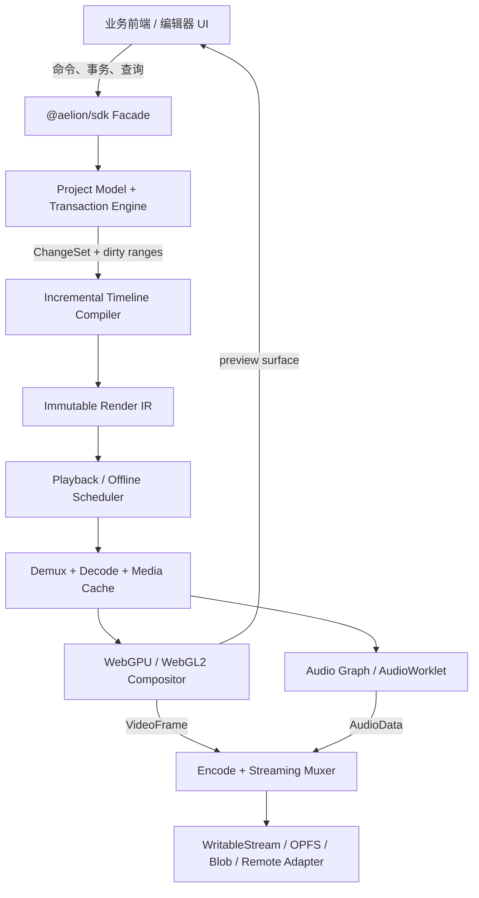
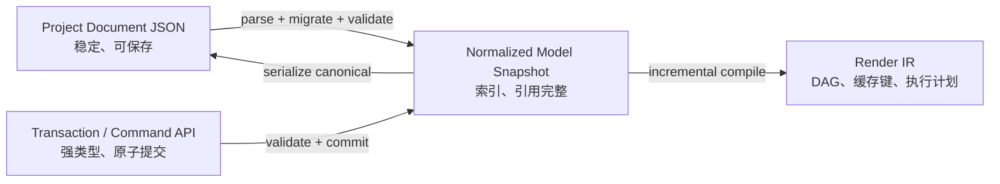
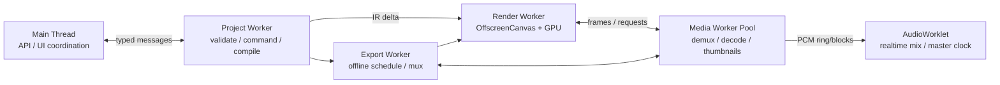
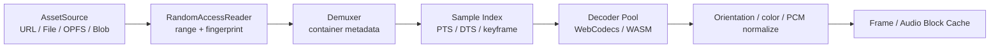
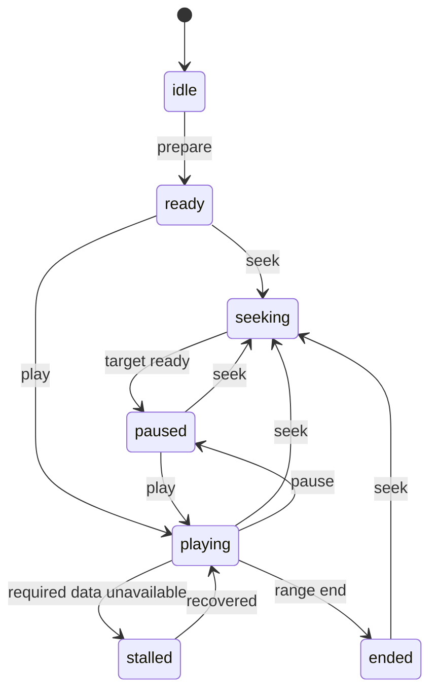
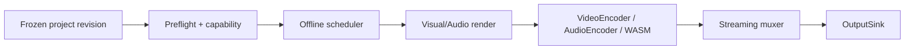

# AelionSDK 浏览器端实时剪辑、渲染与导出 SDK 技术设计文档

| 项目 | 内容 |
|---|---|
| 文档版本 | v0.1 |
| 日期 | 2026-07-10 |
| 状态 | 架构提案，待评审 |
| 目标平台 | 现代桌面与移动浏览器 |
| SDK 名称 | AelionSDK |

## 阅读导航

- **结论与边界**：第 0–4 章。
- **总体技术方案**：第 5–8 章，以及第 14–21 章。
- **Project JSON 与编辑 API**：第 9–13 章，配合完整 JSON 示例。
- **产品能力范围**：第 22–24 章。
- **工程落地**：第 25–33 章。

## 0. 执行摘要

AelionSDK 的目标不是做一个“能在 Canvas 上播放几段视频”的组件，而是做一套可以支撑专业 Web 剪辑产品的媒体运行时：上层只需处理产品交互，SDK 负责素材接入、时间线模型、无损编辑语义、实时预览、音画同步、GPU 合成、离线导出、缓存、兼容性与错误诊断。

本设计建议采用三层模型，而不是让上层直接反复修改一份 JSON 并把它交给渲染器：

1. **Aelion Project Document**：稳定、可序列化、可迁移的 JSON 项目文档，负责保存与跨端交换。
2. **Editor Transaction API**：强类型、事务化的命令 API，负责所有运行时编辑、撤销重做和增量变更。
3. **Render IR**：SDK 内部不可变、增量编译的渲染中间表示，负责高性能执行，不作为公开存储格式。

核心判断如下：

| 议题 | 结论 |
|---|---|
| 上层交互方式 | JSON 用于加载、保存和交换；编辑时优先使用事务 API；也允许受控地应用原子操作集 |
| 时间单位 | 项目文档统一使用整数微秒 `timeUs`；帧率使用有理数；内部使用 64 位整数/有理数运算，禁止浮点累加时间 |
| 预览与导出 | 共用同一份渲染图和效果实现，只允许质量策略不同，避免“预览和成片不一致” |
| 视频编解码 | WebCodecs 优先，WASM 或远端导出适配器作为显式降级能力 |
| 图形后端 | WebGPU 优先，WebGL2 降级；Canvas2D 只承担极简兜底，不承诺完整效果集 |
| 音频 | 预览由 AudioWorklet 驱动主时钟；导出使用确定性的离线音频图 |
| 并发 | 主线程只承载 API 与少量协调；解封装、解码、图形、分析任务尽可能运行在 Worker |
| 扩展 | 内置节点 + 版本化插件协议；效果能力以参数 Schema、后端实现和能力声明组成 |
| 大文件导出 | 从第一天采用流式 Mux 与 `WritableStream`/OPFS，避免把完整成片堆进内存 Blob |
| 兼容策略 | 按运行时能力分级，不根据浏览器名称猜测；不支持的原子能力必须显式报错，绝不静默忽略 |

这套设计保留了 Timeline JSON 易保存、易调试、易跨语言生成的优点，同时避免 JSON-only 方案的几个根本问题：全量重编译、并发修改冲突、撤销困难、字段与底层实现强绑定、运行时对象无法序列化，以及上层可以轻易构造出引用断裂的半合法状态。

---

## 1. 背景与问题定义

浏览器端剪辑同时包含四类不同问题：

- **编辑模型问题**：片段、轨道、转场、关键帧、嵌套序列和素材引用如何表达。
- **实时系统问题**：随机 Seek、解码预取、音画同步、丢帧策略、内存控制和主线程响应。
- **图形/音频问题**：颜色空间、透明度、混合、遮罩、文本排版、效果链与音频混音。
- **导出问题**：确定性逐帧渲染、编码器协商、音视频时间戳、封装与大文件输出。

浏览器不是一个统一的媒体平台。不同设备在 WebCodecs、WebGPU、硬件编码格式、可创建解码器数量、纹理上限、SharedArrayBuffer、文件写入能力上都不同。因此 AelionSDK 的公开承诺必须建立在“能力查询 + 可解释降级”上，而不能建立在某个浏览器版本字符串上。

### 1.1 典型接入方

- 在线短视频与营销视频编辑器
- 模板化视频生成产品
- AI 视频生成后的二次编辑工作台
- 字幕、播客与课程剪辑工具
- 电商素材批量生产工具
- 直播切片、回放包装和轻量演播室
- 企业内部视频生产平台

### 1.2 典型工程规模

设计时不能只覆盖 Demo。建议按以下工程量级规划：

| 等级 | 时长 | 素材数 | 同屏视觉层 | 音轨 | 目标 |
|---|---:|---:|---:|---:|---|
| S | 30 秒 | 20 | 4 | 2 | 移动端模板视频 |
| M | 10 分钟 | 200 | 8 | 8 | 常规桌面剪辑 |
| L | 60 分钟 | 2,000 | 16 | 32 | 长视频/播客，需代理和分段缓存 |
| XL | 4 小时 | 10,000 | 32 | 64 | 模型需可承载；浏览器本地导出按设备能力限制 |

---

## 2. 目标、非目标与质量属性

### 2.1 产品目标

1. 提供从素材注册、编辑、预览到导出的完整浏览器端闭环。
2. 覆盖专业剪辑需要的原子模型，并能由原子操作组合出高阶编辑行为。
3. 上层无需理解解码、GPU、音画同步和封装细节。
4. 同一项目在同一能力档位下可重复、可诊断、可迁移。
5. 支持渐进式接入：只用播放器、只用模型、使用完整编辑/导出内核均可。
6. 保持 UI 无关，React、Vue、Svelte、原生 DOM 或无 UI 环境均可接入。

### 2.2 非目标

首个 GA 版本不以以下能力为硬目标，但架构必须预留接口：

- 完整替代桌面专业调色、三维合成或 DAW 软件。
- 在所有低端移动设备上本地导出 4K 多层复杂工程。
- 在核心包内内置素材商城、云存储、账号、协作服务和业务 UI。
- 执行项目 JSON 中任意 JavaScript、HTML 或远程 Shader 代码。
- 自动规避素材版权、字体授权或浏览器 DRM 限制。
- 保证所有浏览器都能编码同一种 MP4/AAC 配置。

### 2.3 关键质量属性

优先级从高到低：

1. **正确性**：时间、帧、采样、颜色和事务语义明确。
2. **预览/导出一致性**：同一渲染图、同一参数解释。
3. **交互性能**：编辑和 Seek 不因项目总体长度线性恶化。
4. **可诊断性**：能力缺失、素材异常和性能退化有结构化原因。
5. **可扩展性**：效果、素材源、编解码与导出目标可插拔。
6. **易用性**：常用操作一行 API 完成，复杂操作仍可精确控制。
7. **可迁移性**：项目格式版本化，旧文档有确定迁移路径。

---

## 3. “原子能力完全覆盖”的定义

这里的“覆盖”不能只等同于 API 方法数量。AelionSDK 从四个层面定义完整性：

### 3.1 表达完整性

所有可见、可听、可导出的状态都必须存在于 Project Document 或由有版本的资源定义引用，不能藏在 UI 私有状态中。选择框、面板开合等 UI 状态不属于项目；片段范围、关键帧、字体、效果参数等属于项目。

### 3.2 变更完整性

任意合法项目 A 到合法项目 B，都能表示为有限个底层原子操作。底层只需稳定支持：

- 创建实体
- 删除实体
- 设置/移除字段
- 向有序引用列表插入元素
- 从有序引用列表移除元素
- 在有序引用列表移动元素

诸如分割、波纹删除、滚动剪辑、添加转场均是一个事务中的领域命令，由上述操作组合而成。

### 3.3 执行完整性

文档中每个启用的节点必须满足以下二者之一：

- 被当前后端完整编译并执行；
- 在播放/导出前返回带路径和原因的 `UNSUPPORTED_CAPABILITY`。

禁止忽略未知效果后继续导出“看似成功”的错误成片。

### 3.4 能力可发现性

每个原子能力都必须可通过 `CapabilityReport` 查询，包括：预览支持、导出支持、质量档位、限制条件和降级原因。上层据此决定显示、禁用或转交远端执行。

---

## 4. 设计原则

1. **Browser-first**：围绕浏览器的线程、内存、权限和媒体 API 设计，不复制其他平台的对象模型。
2. **Document is data, runtime is state**：JSON 只保存事实，不保存解码器、纹理、File、MediaStream 等运行时对象。
3. **Stable outside, optimized inside**：公开协议可读可迁移；内部 IR 可以为性能迭代。
4. **One semantic graph**：预览和导出共享语义图，质量策略可变，含义不可变。
5. **Exact time, adaptive quality**：逻辑时间必须准确；性能不足时降低预览分辨率或丢展示帧，不能偷偷改变时间线。
6. **Immutable commit**：每次成功事务产生新 revision；渲染线程只观察完整快照。
7. **Explicit ownership**：素材、Worker、GPU、AudioContext 和缓存的创建与释放责任明确。
8. **Capability before fallback**：先报告支持情况，再按接入方允许的策略降级。
9. **No silent corruption**：引用、时间范围、插件版本、编码能力有问题时尽早失败。
10. **Streaming by default**：输入支持按需读取，输出支持边产出边写入。

---

## 5. 总体架构



### 5.1 三层数据模型



Project Document 与 Render IR 必须分离。比如一个视频片段在 JSON 中只是素材引用、时间映射、变换和效果列表；内部会被编译成解码节点、色彩转换节点、纹理节点、效果 DAG、混合节点和缓存策略。这些内部细节不应污染存档协议。

### 5.2 线程拓扑

推荐拓扑如下，实际根据能力降级：



约束：

- 主线程不得执行解封装、逐像素处理、大型 JSON 深拷贝或完整波形分析。
- Worker 间优先传递 `VideoFrame`、`AudioData`、`ArrayBuffer` 等可转移对象。
- SharedArrayBuffer 只作为启用跨源隔离后的加速路径，不能成为 SDK 基线要求。
- 若目标浏览器不支持 Worker 中的图形上下文，渲染器可回主线程，但必须在能力报告中标明 `mainThreadRenderer: true`。
- AudioWorklet 只处理实时安全的数据结构，不做网络、解封装或不可控分配。

---

## 6. 包与模块划分

建议采用 TypeScript monorepo，公开包控制在少量门面，内部按职责拆分：

| 包 | 公开性 | 职责 |
|---|---|---|
| `@aelion/sdk` | 公开 | 统一入口、生命周期、会话、能力查询 |
| `@aelion/model` | 公开 | 文档类型、解析、迁移、只读查询 |
| `@aelion/editor` | 公开 | 事务、领域命令、撤销重做、ChangeSet |
| `@aelion/material-sdk` | 公开 | Material 定义、Graph、验证、预览、打包与测试 |
| `@aelion/plugin-sdk` | 公开 | 高权限自定义节点、素材源和导出适配器 |
| `@aelion/schema` | 公开 | JSON Schema、版本常量、验证器 |
| `@aelion/runtime` | 内部 | 调度、增量编译、Render IR |
| `@aelion/media` | 内部 | 探测、索引、解封装、解码、代理、缓存 |
| `@aelion/render-webgpu` | 内部/高级 | WebGPU 图形后端 |
| `@aelion/render-webgl` | 内部/高级 | WebGL2 降级后端 |
| `@aelion/audio` | 内部 | 实时和离线音频图 |
| `@aelion/export` | 内部 | 编码协商、离线调度、Mux、输出 Sink |
| `@aelion/devtools` | 可选 | 图状态、帧耗时、缓存、诊断面板 |

初期可以在一个仓库内发布单包，保留上述源码边界；在 API 稳定前不必为了拆包增加使用成本。最终 `@aelion/sdk` 应支持 tree-shaking，并提供 `model-only` 入口，便于服务端只操作项目文档。

### 6.1 建议目录

```text
AelionSDK/
├── packages/
│   ├── sdk/
│   ├── model/
│   ├── editor/
│   ├── runtime/
│   ├── media/
│   ├── render-webgpu/
│   ├── render-webgl/
│   ├── audio/
│   ├── export/
│   ├── material-sdk/
│   ├── plugin-sdk/
│   └── devtools/
├── schemas/
├── examples/
├── fixtures/
├── benchmarks/
├── apps/
│   ├── playground/
│   └── compatibility-lab/
└── docs/
```

---

## 7. SDK 生命周期与核心对象

### 7.1 初始化

```ts
import { Aelion } from '@aelion/sdk';

const capability = await Aelion.detectCapabilities();

const sdk = await Aelion.create({
  assetBaseUrl: '/aelion/',
  preferredGraphicsBackend: 'webgpu',
  fallbackPolicy: 'allow-degraded-preview',
  memoryBudget: { mode: 'adaptive', maxBytes: 768 * 1024 * 1024 },
  telemetry: { enabled: false },
});
```

初始化必须是异步的，因为需要加载 Worker/WASM、查询 GPU adapter、探测编码器配置并建立能力表。SDK 不应在 import 时创建 AudioContext、申请 GPU 或注册全局事件。

### 7.2 打开项目

```ts
const session = await sdk.openProject(projectDocument, {
  resolveAsset: async ({ asset, signal }) => {
    // 鉴权信息由应用在运行时注入，不写入项目 JSON。
    return fetch(asset.locator.uri, {
      headers: { Authorization: await getMediaToken() },
      signal,
    });
  },
  migration: 'upgrade-in-memory',
  validation: 'strict',
});
```

打开流程固定为：

1. 识别 `schemaVersion`。
2. 在内存中逐版本迁移。
3. 做结构校验、引用校验和语义校验。
4. 创建不可变 revision 0 快照与时间索引。
5. 异步探测素材；缺失素材不必阻止打开项目，但会形成显式占位状态。
6. 编译当前播放头附近的最小 Render IR。

### 7.3 创建播放器

```ts
const player = await session.createPlayer({
  canvas,
  sequenceId: 'seq_main',
  previewQuality: 'adaptive',
  audio: { mode: 'enabled', latencyHint: 'interactive' },
});

await player.seek(3_500_000, { mode: 'exact' });
await player.play();
```

### 7.4 释放

所有长生命周期对象必须实现显式释放：

```ts
await player.dispose();
await session.dispose();
await sdk.dispose();
```

`dispose()` 应幂等，并关闭 Worker、解码器、帧缓存、GPU 纹理和内部 AudioNode。不能依赖垃圾回收器及时释放硬件解码器或 GPU 资源。

---

## 8. 能力检测与兼容分级

### 8.1 CapabilityReport

```ts
interface CapabilityReport {
  environment: {
    crossOriginIsolated: boolean;
    hardwareConcurrency: number;
    deviceMemoryGiB?: number;
  };
  decode: Record<string, CodecCapability>;
  encode: Record<string, CodecCapability>;
  graphics: {
    backends: Array<'webgpu' | 'webgl2' | 'canvas2d'>;
    selected: 'webgpu' | 'webgl2' | 'canvas2d';
    maxTextureSize: number;
    floatTextures: boolean;
    hdr: boolean;
  };
  audio: {
    audioWorklet: boolean;
    audioDecoder: boolean;
    audioEncoder: boolean;
    maxChannels: number;
  };
  io: {
    transferableStreams: boolean;
    opfs: boolean;
    fileSystemWritable: boolean;
  };
  features: Record<string, FeatureCapability>;
  recommendedTier: 'A' | 'B' | 'C' | 'unsupported';
}
```

### 8.2 分级定义

| 档位 | 典型能力 | 承诺 |
|---|---|---|
| A | WebCodecs + WebGPU + AudioWorklet + OffscreenCanvas | 完整实时预览；本地导出取决于编码器配置 |
| B | WebCodecs + WebGL2 + AudioWorklet | 完整基础剪辑；部分高级效果降级或不可用 |
| C | 缺少 WebCodecs 或 Worker 图形能力 | 有限预览；WASM/HTMLMediaElement 适配器；导出通常需 WASM 或远端 |
| unsupported | 缺少必要图形/音频/Worker 能力 | 只允许文档模型操作，不能创建完整播放器 |

能力检测必须测试具体配置，例如 `avc1.640028 + 1920x1080 + 30fps`，不能只判断 `VideoEncoder` 是否存在。

### 8.3 降级规则

- WebGPU → WebGL2：保持时间和布局语义；不支持的效果显式禁用或改用有声明的兼容实现。
- SharedArrayBuffer → Transferable：降低预取窗口或并发，不改变结果。
- 硬件编码 → 软件/WASM：必须由调用方允许，并给出预计速度和内存风险。
- 本地导出 → RemoteExportAdapter：必须由业务显式配置；SDK 不能在未授权时上传素材。
- 高分辨率预览 → 1/2、1/4 动态分辨率：只影响预览采样质量，不影响导出。
- 解码跟不上 → 丢展示帧：播放头仍由主时钟推进，禁止把时间线整体放慢而不通知上层。

---

## 9. Aelion Project Document v1

### 9.1 为什么不是“只有一份 Timeline JSON”

JSON 仍然是 AelionSDK 最重要的对接协议，但职责被严格限制为：

- 持久化项目；
- 在前端、服务端和其他语言间交换；
- 做模板生成、审计、版本控制和问题复现；
- 作为一次性全量加载或快照输出。

实时拖拽过程中，不建议上层每 16ms 克隆并提交整份 JSON。这样会产生大量序列化、校验、GC 和全量 Diff 成本，也无法自然表达事务、撤销、冲突和脏区间。运行中应使用第 12 章的事务 API。

### 9.2 顶层结构

文档采用 normalized entity maps：实体按 ID 放在顶层字典，父对象只保存有序 ID 引用。相比深层嵌套，这能带来 O(1) 实体定位、稳定引用、较小的操作集以及更清晰的协作冲突。

```json
{
  "$schema": "https://schemas.aelion.dev/project/v1.json",
  "schemaVersion": "1.0.0",
  "projectId": "prj_demo",
  "metadata": {},
  "settings": {},
  "assets": {},
  "sequences": {},
  "tracks": {},
  "items": {},
  "materialInstances": {},
  "transitions": {},
  "markers": {},
  "linkGroups": {},
  "extensions": {}
}
```

规则：

- ID 是不透明、项目内唯一、创建后不变的字符串；推荐 UUIDv7 或带随机性的 ULID。
- JSON object 的键顺序没有语义；轨道、片段和效果顺序必须通过显式 ID 数组表达。
- 所有 `*Id` 都必须能解析到正确类型的实体，不能保留悬空引用。
- 标准字段默认 `additionalProperties: false`；业务扩展只能写入带命名空间的 `extensions`。
- 文档不得包含 Blob、File、句柄、访问令牌、Cookie、解码帧或任意可执行代码。
- 运行时 revision 不属于文档语义，由 Session 管理；业务如需服务端版本号，可写入自己的扩展命名空间。

### 9.3 命名与基本类型

- JSON 字段统一使用 `camelCase`。
- 时间字段以 `Us` 结尾，值为安全整数微秒。
- 空值只有在 Schema 明确允许时使用；可省略字段不应写成 `null`。
- 枚举使用小写 kebab-case，例如 `cross-dissolve`。
- 颜色使用线性或编码空间中显式声明的 RGBA 数组，不能用含糊的 CSS 字符串作为 canonical 值。
- 比率使用 `{ numerator, denominator }`，禁止用 `29.97` 代替 `30000/1001`。

```ts
type EntityId = string;
type JsonPrimitive = string | number | boolean | null;
type JsonValue = JsonPrimitive | JsonValue[] | { [key: string]: JsonValue };
type ExtensionMap = Record<string, JsonValue>; // key 必须是反向域名命名空间

interface Rational {
  numerator: number;   // safe integer
  denominator: number; // positive safe integer
}

interface Vec2 { x: number; y: number }
interface ColorRGBA {
  space: 'srgb-linear' | 'display-p3-linear' | 'rec2020-linear';
  rgba: [number, number, number, number];
}
```

Rational 在 canonical 输出前约分，分母必须为正，零统一表示 `0/1`。所有数值必须有限；不同参数的更窄范围由 Schema 规定。

`JsonValue` 中的 `null` 只供明确允许 null 的扩展 payload 使用；标准可选字段仍应省略而不是写 null。

### 9.4 Project settings

```ts
interface ProjectSettings {
  defaultSequenceId: EntityId;
  defaultStillDurationUs: number;
  locale?: string;
  timezone?: string;
  missingAssetPolicy: 'placeholder' | 'error';
  missingMaterialPolicy: 'placeholder' | 'error';
  missingPluginPolicy: 'placeholder' | 'error';
}
```

`locale` 影响默认文本排版和展示，但不能隐式改变已经显式保存的字体、方向、数字形态或换行规则。

### 9.5 Asset

Asset 代表媒体身份，不等于某个已经打开的文件对象。

```ts
interface Asset {
  id: EntityId;
  kind: 'video' | 'audio' | 'image' | 'font' | 'lut' | 'binary';
  name?: string;
  locator: AssetLocator;
  contentHash?: { algorithm: 'sha256'; value: string };
  byteLength?: number;
  mimeType?: string;
  representations?: AssetRepresentation[];
  probeHint?: MediaProbeHint;
  metadata?: Record<string, JsonValue>;
  extensions?: ExtensionMap;
}

type AssetLocator =
  | { type: 'url'; uri: string }
  | { type: 'runtime-binding'; bindingId: string }
  | { type: 'opfs'; path: string }
  | { type: 'data'; mimeType: string; base64: string };

interface AssetRepresentation {
  id: string;
  role: 'original' | 'proxy' | 'thumbnail' | 'waveform';
  locator: AssetLocator;
  mimeType?: string;
  width?: number;
  height?: number;
  bitrate?: number;
  timeMapping?: { type: 'identity' } | {
    type: 'linear'; sourceStartUs: number; representationStartUs: number; rate: Rational;
  };
}

interface MediaProbeHint {
  durationUs?: number;
  width?: number;
  height?: number;
  videoCodec?: string;
  audioCodec?: string;
}
```

`representations` 省略时，Asset 顶层 locator 即 original；存在列表时也必须恰好有一个 `role = original`，且它与顶层 locator 表示同一内容身份。其他 representation ID 在该 Asset 内唯一。

设计约束：

- `runtime-binding` 用于 File、FileSystemFileHandle、MediaStream 等不可序列化对象；应用通过 `session.assets.bind(bindingId, source)` 注入。
- `data` 只允许小型资源，默认上限建议 256 KiB；大媒体 Base64 会造成 33% 体积膨胀和多份内存拷贝。
- URL 不保存鉴权头。鉴权、签名刷新和 Range 请求由 `AssetResolver` 处理。
- `probeHint` 只是缓存提示，真实解封装结果与提示不一致时以真实结果为准并产生诊断。
- `representations` 可描述 original、proxy、thumbnail、waveform 等同源版本。预览可选代理，导出默认使用 original。
- 代理素材必须带可验证的时间映射；仅“时长大致相同”不足以保证帧级替换。

### 9.6 Sequence

Sequence 是可独立播放和导出的组合，也可以被其他 Sequence 作为嵌套片段引用。

```ts
interface Sequence {
  id: EntityId;
  name?: string;
  format: {
    width: number;
    height: number;
    pixelAspectRatio: Rational;
    frameRate: Rational;
    sampleRate: 44100 | 48000 | 96000;
    channelLayout: 'mono' | 'stereo' | '5.1';
    workingColorSpace: 'srgb-linear' | 'display-p3-linear' | 'rec2020-linear';
    backgroundColor: ColorRGBA;
  };
  duration:
    | { mode: 'content' }
    | { mode: 'fixed'; durationUs: number; overflow: 'clip' | 'allow' };
  trackIds: EntityId[];
  transitionIds: EntityId[];
  materialInstanceIds: EntityId[];
  markerIds: EntityId[];
  extensions?: ExtensionMap;
}
```

Sequence 的 `trackIds` 同时表达轨道顺序。视觉轨道从数组前部向后部合成，即后面的视觉轨道在上方；音轨顺序不影响求和结果，但影响明确需要顺序的总线/路由插件。

`duration.mode = content` 时，duration 是所有 track 中全部 item（无论 item/track 是否 enabled）的最大 range 终点；空 Sequence 为 0。Marker 不延长内容，效果 tail 也不自动改变编辑时长。播放/导出需要尾响时，通过 `includeEffectTail` 显式扩展。`fixed + clip` 裁掉固定终点外内容；`fixed + allow` 允许内容存在于终点外，但默认播放/导出仍止于固定时长。

### 9.7 Track

```ts
interface Track {
  id: EntityId;
  sequenceId: EntityId;
  kind: 'visual' | 'audio' | 'caption';
  name?: string;
  enabled: boolean;
  locked: boolean;
  itemIds: EntityId[];
  materialInstanceIds: EntityId[];
  audio?: {
    gainDb: Animatable<number>;
    pan: Animatable<number>;
    muted: boolean;
  };
  extensions?: ExtensionMap;
}
```

- `enabled` 参与渲染；`locked` 只约束标准编辑命令，不改变渲染结果。
- 同轨 item 可重叠。视觉 item 发生普通重叠时，`itemIds` 中靠后的 item 在上；音频 item 同时混合。
- Caption track 保存语义字幕。它可以通过样式渲染进画面，也可以在导出时转换为 sidecar/内嵌字幕。
- Track Material 链在该轨的 item 合成/混音之后执行；Sequence Material 链在所有轨道之后执行。

Audio item 的公共混音属性为：

```ts
interface AudioProperties {
  gainDb: Animatable<number>;
  pan: Animatable<number>; // -1 左，0 中，1 右
  fadeInUs?: number;
  fadeOutUs?: number;
  channelMap?: number[][];
}
```

`fadeInUs`/`fadeOutUs` 是基础便利包络，与 `gainDb` 自动化在线性振幅域相乘；必须非负且二者各自不超过 item duration。更复杂的淡变直接使用 gain keyframes。

媒体 `timeMapping` 只定义时间对应关系。音频默认通过重采样实现，因此速度改变时音高随之改变；“保留音高变速”命令会插入精确版本的 `time-stretch` MaterialInstance，独立变调也由版本化 audio Material 表达。这样算法和参数能够存档、迁移和复现。

### 9.8 Item 公共字段

```ts
interface BaseItem {
  id: EntityId;
  trackId: EntityId;
  type:
    | 'video'
    | 'audio'
    | 'image'
    | 'text'
    | 'caption'
    | 'shape'
    | 'generator'
    | 'nested-sequence'
    | 'adjustment';
  name?: string;
  enabled: boolean;
  range: { startUs: number; durationUs: number };
  materialInstanceIds: EntityId[];
  linkGroupId?: EntityId;
  markerIds?: EntityId[];
  metadata?: Record<string, JsonValue>;
  extensions?: ExtensionMap;
}
```

所有区间采用半开语义 `[startUs, startUs + durationUs)`。因此两个首尾相接的 item 不会在边界处同时激活。`durationUs` 必须大于 0；标准时间线 item 的 `startUs` 不得小于 0。

### 9.9 媒体 Item 与源时间映射

视频和音频各自是独立 item，即使来自同一文件。便利命令 `insertMedia()` 可以同时创建视频 item、音频 item 和 `linkGroup`。这样可以独立选择流、删除音频、做 J/L Cut、替换声道或解除音画链接。

```ts
interface MediaSource {
  assetId: EntityId;
  stream: { type: 'video' | 'audio'; index: number };
  sourceRange: { startUs: number; durationUs: number };
  timeMapping:
    | {
        type: 'linear';
        rate: Rational;
        reverse: boolean;
        boundary: 'error' | 'hold' | 'loop' | 'transparent';
      }
    | {
        type: 'curve';
        points: Array<{
          itemTimeUs: number;
          sourceTimeUs: number;
          interpolation: 'linear' | 'hold' | 'cubic';
          easing?: Easing;
        }>;
        boundary: 'error' | 'hold' | 'loop' | 'transparent';
      };
}
```

媒体 item 在 BaseItem 之外必须带 `source: MediaSource`；video item 还带 `visual: VisualProperties`，audio item 带 `audio: AudioProperties`。Image item 使用 `assetId` + visual，不需要 stream/timeMapping；其持续时间完全由 item range 决定。

定义：

- `rate = 源时间增量 / item 本地时间增量`；`2/1` 是二倍速，`1/2` 是半速。
- linear 模式在无 loop/hold 时，sourceRange、rate 与 item duration 必须相容。
- curve 模式明确表示 `item local time → source presentation time`。它支持变速、停帧、倒放和方向改变。
- curve 首点必须位于 `itemTimeUs = 0`，末点必须位于 item duration；点按本地时间严格递增。
- `sourceTimeUs` 基于解封装后规范化的 presentation timeline，而不是文件字节偏移或 decode timestamp。
- 方向频繁改变虽然合法，但会触发 `EXPENSIVE_TIME_MAPPING` 诊断，因为解码器需要反复访问 GOP。

### 9.10 视觉属性与坐标系

Aelion 使用 Sequence 逻辑像素坐标：

- 原点在左上角；
- x 向右，y 向下；
- 旋转角度为顺时针角度；
- anchor 使用 item 内容边界内的归一化坐标；
- 所有视觉合成在 working color space 的线性光、预乘 Alpha 下完成。

`positionPx` 表示 item anchor 在 Sequence 中的位置；因此全画布内容以 anchor `(0.5, 0.5)` 居中时，position 为 `(width/2, height/2)`。Text item 的 `box` 先定义其本地布局框，visual transform 再作用于该框；若文本只需固定 box 位置，可将 transform position 置 `(0, 0)`，由 box 坐标定位。

```ts
interface VisualProperties {
  fit: 'contain' | 'cover' | 'fill' | 'none';
  transform: {
    positionPx: Animatable<Vec2>;
    anchor: Animatable<Vec2>;       // 通常在 0..1
    scale: Animatable<Vec2>;
    rotationDeg: Animatable<number>;
    skewDeg: Animatable<Vec2>;
  };
  crop: Animatable<{ left: number; top: number; right: number; bottom: number }>;
  opacity: Animatable<number>;
  blendMode:
    | 'normal' | 'multiply' | 'screen' | 'overlay'
    | 'darken' | 'lighten' | 'color-dodge' | 'color-burn'
    | 'hard-light' | 'soft-light' | 'difference' | 'exclusion';
}
```

裁剪量是经过方向校正后的内容归一化比例，范围 0..1。`fit` 先计算基准布局，再应用 crop 和 transform。Builder 可提供 `fitToCanvas()`、`coverCanvas()` 等便利函数，但 canonical 文档只保存最终语义字段。

### 9.11 Animatable 与关键帧

静态值直接保存；动态值使用带保留字段 `animation` 的包装：

```ts
type Animatable<T> =
  | T
  | {
      animation: {
        timeSpace: 'item' | 'sequence';
        preInfinity: 'hold' | 'linear' | 'none';
        postInfinity: 'hold' | 'linear' | 'none';
        keyframes: Array<{
          timeUs: number;
          value: T;
          interpolation: 'hold' | 'linear' | 'cubic-bezier';
          easing?: Easing;
        }>;
      };
    };

type Easing =
  | { type: 'linear' }
  | { type: 'steps'; count: number; position: 'start' | 'end' }
  | { type: 'cubic-bezier'; x1: number; y1: number; x2: number; y2: number };
```

- `easing` 描述当前关键帧到下一关键帧的进度映射。
- 同一动画内 `timeUs` 严格递增，禁止重复时间。
- item time 从 item 左边界的 0 开始，不受其时间线位置影响。
- sequence time 适合在全局时间上保持不动的自动化；移动 item 时不会重定位这些关键帧。
- 颜色默认在线性工作空间插值，角度默认走数值路径；如需最短角路径由参数 Schema 显式声明。
- 插件参数只有在插件 manifest 声明 `animatable: true` 时才能使用关键帧。

### 9.12 Text 与 Caption

文本不能把 HTML DOM 当作存档格式，否则浏览器字体、CSS、布局和导出结果难以保持一致。canonical 文本模型应由段落、run 和显式样式组成。

```ts
interface TextItem extends BaseItem {
  type: 'text';
  box: { x: number; y: number; width: number; height: number };
  overflow: 'clip' | 'ellipsis' | 'visible' | 'auto-fit';
  writingMode: 'horizontal-tb' | 'vertical-rl' | 'vertical-lr';
  paragraphs: Array<{
    style: ParagraphStyle;
    runs: Array<{
      text: string;
      style: {
        fontAssetId: EntityId;
        fontSizePx: Animatable<number>;
        fontWeight: number;
        fontStyle: 'normal' | 'italic';
        letterSpacingPx: number;
        fill: Paint;
        stroke?: { paint: Paint; widthPx: number };
      };
    }>;
  }>;
  visual: VisualProperties;
}
```

确定性模式要求字体作为 Asset 提供并由统一 shaping/rasterizer（建议 HarfBuzz + FreeType WASM）处理。允许使用系统字体的快速模式，但能力报告和导出结果必须标记 `fontDeterminism: false`。

Caption item 额外保存语义文本、说话人、语言和可选词级时间。渲染样式可以指向共享 caption style；字幕导出必须保留原始语义时间，不能从光栅化画面反推。

### 9.13 Shape、Generator、Nested Sequence 与 Adjustment

- `shape`：矩形、圆角矩形、椭圆、线和安全的矢量 Path；支持 fill、stroke、dash 与 transform。
- `generator`：纯色、渐变、棋盘格、时间码等无外部媒体源节点。
- `nested-sequence`：引用另一 Sequence，并具有显式的源时间映射；项目中的 Sequence 依赖图必须无环。
- `adjustment`：自身不产生像素，在有效区间内对其下方已合成图层应用 Material chain。

SVG 导入必须经过净化并转换为内部 Path；不执行 script、event handler、foreignObject、外链 CSS 或外链图片。

### 9.14 Material Instance

```ts
interface MaterialInstance {
  id: EntityId;
  definition: {
    packageId: string;
    packageVersion: string;
    packageIntegrity: string;
    materialId: string;
  };
  name?: string;
  name?: string;
  enabled: boolean;
  previewPolicy?: 'required' | 'skippable-when-degraded';
  parameters: Record<string, JsonValue | Animatable<JsonValue>>;
  resourceBindings?: Record<string, MaterialResourceBinding>;
  inputBindings?: Record<string, MaterialInputBinding>;
  randomSeed?: number;
  extensions?: ExtensionMap;
}
```

Material 的执行顺序由宿主对象的 `materialInstanceIds` 决定。MaterialInstance 只能被一个宿主引用；复用“预设”应复制实例，避免一个参数修改意外影响多个 item。`skippable-when-degraded` 只允许质量控制器在无法维持 deadline 时临时跳过，并必须触发 quality event；暂停后的 full-quality still 和导出始终执行。缺少 Material、版本/完整性不匹配或参数 Schema 不合法时，项目仍可在 placeholder 模式下打开，但不能在 strict 模式下成功导出。完整 Definition、Graph、端口和资源规则见 AMP v1。

### 9.15 Transition

Transition 是显式实体，不通过“在轨道数组里夹一个伪片段”表达：

```ts
interface Transition {
  id: EntityId;
  sequenceId: EntityId;
  trackId: EntityId;
  kind: 'visual' | 'audio';
  fromItemId: EntityId;
  toItemId: EntityId;
  range: { startUs: number; durationUs: number };
  materialInstanceId: EntityId;
  extensions?: ExtensionMap;
}
```

约束与语义：

- from/to item 必须属于同一 Sequence 和兼容 Track。
- 两个 item 在 transition 的完整区间内都必须能产生有效内容，或明确使用 hold/transparent boundary。
- item Material 链先执行，transition 接收两个处理后的输入；transition 结果再进入 track Material 链。
- transition 区间内，这两个 item 在该轨上的常规输出被 transition 输出替代，避免双重合成。
- visual transition 的进度为 `(t - startUs) / durationUs`；首端为 0，末端趋近 1。
- audio transition 通常是等功率或线性 crossfade，也可以由音频插件实现。
- 添加 transition 的高阶命令可选择 `overlap`、`trim-handles` 或 `reject` 策略，但存档只保存最终区间。

### 9.16 Marker 与 LinkGroup

Marker 可以属于 Sequence 或 Item，保存时间、持续时间、颜色和结构化 payload。Marker 不参与渲染。

```ts
interface Marker {
  id: EntityId;
  owner: { type: 'sequence' | 'item'; id: EntityId };
  timeUs: number; // sequence owner 为全局时间，item owner 为 item-local 时间
  durationUs: number;
  label?: string;
  color?: string; // 仅 UI 标签色，canonical 为 #RRGGBB 或 #RRGGBBAA
  payload?: JsonValue;
}
```

Sequence owner 的 marker ID 必须出现在该 Sequence 的 `markerIds`；Item owner 的 marker ID 必须出现在 item 的可选 `markerIds`。Marker 时间范围不得越出其 owner 的有效范围。

LinkGroup 表示编辑联动而非父子渲染关系：

```ts
interface LinkGroup {
  id: EntityId;
  kind: 'av-sync' | 'edit-group';
  itemIds: EntityId[];
  syncOffsetsUs?: Record<EntityId, number>;
}
```

标准 move、trim、split、delete 命令默认尊重 link group；调用方可显式 `linked: false`。对音画同步组执行不对称编辑时，SDK 应给出 sync offset 诊断，而不是静默解除链接。

### 9.17 完整示例

仓库中的 [Project Document v1 完整示例](../examples/aelion-project-v1.example.json) 展示了双视频片段、视觉转场、文字关键帧、调色、背景音乐、音量自动化和音画链接。

---

## 10. 精确时间模型

### 10.1 为什么公开协议选择微秒

候选包括秒浮点数、帧号、音频 sample、任意 timebase 和纳秒。v1 选择整数微秒，原因是：

- 与 WebCodecs 的 timestamp/duration 单位一致；
- 10 小时也远低于 JavaScript 安全整数上限；
- JSON 可读性和跨语言实现良好；
- 足以表达视频帧与常规音频编辑；
- 可以通过内部有理数余数分配避免长期累积漂移。

不使用浮点秒。`0.1 + 0.2` 一类误差会在边界判断、吸附、转场和音频采样映射中扩散。

### 10.2 帧边界

帧率保存为 `N/D`。第 `n` 个输出帧的微秒时间戳定义为：

```text
frameStartUs(n) = floor(n × 1,000,000 × D / N)
frameDurationUs(n) = frameStartUs(n + 1) - frameStartUs(n)
```

因此 `30000/1001` 的帧时长会在相邻整数微秒间分配，不会通过反复相加一个四舍五入值而漂移。内部实现使用 64 位整数或 BigInt 中间值，乘法前检查溢出。

### 10.3 音频采样边界

给定 sample rate `R`，时间边界对应的 sample index 为：

```text
sampleIndex(tUs) = floor(tUs × R / 1,000,000)
```

离线音频块的 sample 数通过相邻边界相减得出。所有重采样器必须携带相位余数，不能每个块独立四舍五入。

### 10.4 VFR、DTS 与 PTS

- 素材可为 VFR；Asset Index 保存每帧规范化 PTS、duration、DTS 和 keyframe 信息。
- 剪辑语义基于 PTS；解码调度可使用 DTS。
- 对缺失、重复或倒退 timestamp 的文件，demuxer 必须按容器规则规范化并记录诊断。
- 导出 Sequence 为 CFR 时，调度器按输出帧时间采样源；VFR 输入不需要先转码成 CFR。
- 后续版本可支持 VFR 输出，但 v1 本地视频导出以 CFR 为基线。

### 10.5 吸附与边界策略

SDK 提供：

```ts
session.time.snap(timeUs, {
  targets: ['frame', 'item-edge', 'marker', 'playhead'],
  thresholdPx: 8,
  view: { startUs, endUs, widthPx },
});
```

吸附阈值是 UI 像素概念，必须由当前 viewport 转成时间，不能固定为若干微秒。编辑 API 可选择 `snap: 'none' | 'frame' | SnapRequest`。音频精细编辑可以不吸附视频帧，但导出画面仍只在帧采样点求值。

---

## 11. 校验、迁移与序列化

### 11.1 五层校验

1. **语法校验**：JSON 可解析、大小与深度未超限。
2. **Schema 校验**：字段、类型、枚举、数值范围和 required。
3. **引用校验**：所有 ID 类型匹配、无重复宿主、无悬空引用。
4. **语义校验**：时间区间、轨道类型、transition handles、nested cycle、关键帧和 Material 参数/输入绑定。
5. **运行能力校验**：素材可访问、codec/profile、GPU feature、字体和插件实现可用。

前四层是文档合法性；第五层是“此设备是否能按指定目标执行”，两者不能混为一谈。

### 11.2 校验结果

```ts
interface Diagnostic {
  code: string;
  severity: 'info' | 'warning' | 'error' | 'fatal';
  message: string;
  path?: Array<string | number>;
  entityId?: string;
  rangeUs?: { startUs: number; durationUs: number };
  recoverable: boolean;
  details?: Record<string, JsonValue>;
}
```

错误消息用于人读，`code`、`path` 和 `details` 用于程序处理。稳定 code 不应包含浏览器异常全文。

### 11.3 迁移

- `schemaVersion` 独立于 npm 包版本。
- 每个迁移函数是纯函数：`v1.1 → v1.2`，不得联网或探测设备。
- 迁移链必须保留未知的 namespaced extensions。
- 当前 SDK 遇到未知 major 版本必须拒绝打开；遇到可兼容的未来 minor 字段只能在 Schema 明确允许时保留。
- `upgrade-in-memory` 不修改调用方原对象；只有显式 `serialize()` 才输出新版本。
- 每条迁移都需要 golden fixture、正向测试和重复执行幂等测试。

### 11.4 Canonical serialization

```ts
const document = await session.serialize({
  canonical: true,
  includeProbeHints: true,
  targetSchemaVersion: '1.0.0',
});
```

canonical 模式规定：

- map key 按 Unicode code point 排序；
- ID 数组保留语义顺序；
- 不输出运行时缓存和 revision；
- 不输出 NaN、Infinity、负零或非整数时间；
- 保留 Schema 要求的默认值，移除无语义的可选空字段；
- 输出 UTF-8，可选稳定两空格缩进；
- 相同语义快照应生成字节稳定的结果，便于 hash、缓存和审计。

---

## 12. 编辑 API、事务与原子操作

### 12.1 只读快照

应用通过只读 snapshot 查询项目，不直接修改内部对象：

```ts
const snapshot = session.project.getSnapshot();
const item = snapshot.items.get('item_video_a');
const active = snapshot.query.itemsAt('seq_main', 3_000_000);
```

快照使用结构共享。旧快照可以短暂安全读取，但应用不能长期持有大量 revision；Dev 模式可对超时快照发出警告。

### 12.2 事务 API

```ts
const result = await session.edit(
  { label: '移动并淡入标题', baseRevision: session.revision },
  tx => {
    tx.items.move('item_title', { startUs: 1_500_000 });
    tx.items.set('item_title', ['visual', 'opacity'], {
      animation: {
        timeSpace: 'item',
        preInfinity: 'hold',
        postInfinity: 'hold',
        keyframes: [
          { timeUs: 0, value: 0, interpolation: 'linear' },
          { timeUs: 400_000, value: 1, interpolation: 'linear' }
        ]
      }
    });
  },
);

console.log(result.revision, result.changeSet, result.affectedRanges);
```

事务保证：

- 回调中的所有变化要么一起提交，要么完全不提交；
- 中间态不会被播放器、导出任务或事件订阅者观察到；
- commit 前执行引用和领域不变量校验；
- 一个 commit 只触发一次 project change 事件；
- 返回精确 ChangeSet、反向操作、脏实体和受影响时间范围；
- 若 `baseRevision` 已过期，抛出 `REVISION_CONFLICT`，除非调用方选择可证明安全的 rebase 策略。

### 12.3 底层原子操作

ChangeSet 不直接采用 RFC 6902。数组下标在并发和撤销时不稳定，而且 RFC 6902 不知道实体类型、引用和领域不变量。Aelion 的底层操作以 entity ID 为寻址核心：

```ts
type AtomicOperation =
  | { op: 'createEntity'; collection: CollectionName; id: EntityId; value: JsonObject }
  | { op: 'deleteEntity'; collection: CollectionName; id: EntityId }
  | { op: 'setField'; collection: CollectionName; id: EntityId; path: string[]; value: JsonValue }
  | { op: 'removeField'; collection: CollectionName; id: EntityId; path: string[] }
  | { op: 'listInsert'; collection: CollectionName; id: EntityId; path: string[]; beforeId?: EntityId; valueId: EntityId }
  | { op: 'listRemove'; collection: CollectionName; id: EntityId; path: string[]; valueId: EntityId }
  | { op: 'listMove'; collection: CollectionName; id: EntityId; path: string[]; valueId: EntityId; beforeId?: EntityId };

interface ChangeSet {
  id: string;
  baseRevision: bigint;
  committedRevision: bigint;
  label?: string;
  operations: AtomicOperation[];
  affectedEntityIds: EntityId[];
  affectedRanges: Array<{ sequenceId: EntityId; startUs: number; durationUs: number }>;
}
```

每个 ChangeSet 在 commit 时再次做整体校验。`applyChangeSet()` 不是绕过校验的后门。

### 12.4 高阶领域命令

建议首个正式版覆盖：

| 类别 | 命令 |
|---|---|
| 素材 | insert media/image/audio、replace source、select stream、create proxy |
| 基础 | add、remove、duplicate、move、enable、rename |
| 时间 | trim、split、slip、slide、roll、rate-stretch、reverse、freeze |
| 区间 | lift range、ripple delete、insert time、overwrite range |
| 轨道 | add/remove/reorder、mute/enable/lock、route |
| 链接 | link/unlink、move linked、maintain sync |
| 转场 | add/remove/replace/resize transition |
| 动画 | add/move/remove keyframe、set easing、convert static/animated |
| Material | add/remove/reorder/bypass/copy Material、apply preset |
| 组合 | nest items、unnest、duplicate sequence |
| 音频 | normalize、fade、crossfade、channel mapping |
| 字幕 | add cue、split/merge cue、import/export subtitle |

示例：

```ts
const split = await session.commands.splitItem({
  itemId: 'item_video_a',
  atUs: 4_250_000,
  linked: true,
});

await session.commands.trimItem({
  itemId: split.rightItemId,
  edge: 'start',
  toUs: 4_500_000,
  mode: 'ripple',
  preserve: 'source-content',
});
```

命令的精确定义必须进入 API contract，例如 split：

- 左 item 保留原 ID，右 item 获得新 ID；
- source mapping 在切点精确切分；
- item-local 关键帧按左右区间裁剪并对右侧重新基准化；
- 跨切点效果按 manifest 的 `splitPolicy` 复制、重置或拒绝；
- transition 和 link group 自动按规则更新；
- 一个命令只形成一个可撤销事务。

### 12.5 Undo/Redo

- 每个成功本地事务保存由引擎生成的 inverse ChangeSet。
- Undo/Redo 作用于语义事务，而不是每个鼠标 move 事件；UI 可用 `mergeKey` 合并连续拖拽。
- 异步素材 probe、缓存填充和播放器状态不进入 undo stack。
- 新编辑发生后默认清空 redo 分支。
- 可配置历史条数和内存预算；大字段替换可使用持久化快照/内容寻址减少复制。
- 协作场景不能简单应用旧 inverse；应由 CollaborationAdapter 生成基于当前 revision 的补偿事务。

### 12.6 编辑与正在播放/导出的关系

- Player 订阅最新 committed revision，并在安全帧边界原子切换 IR。
- 播放头附近发生结构变化时，调度器取消过期请求并预热新图；当前已提交给音频设备的小缓冲无法“收回”，延迟上限应可查询。
- ExportJob 创建时冻结一个 project revision。后续编辑不改变该任务，确保结果可复现。
- 删除正在解码的素材只取消其未来请求；已转移的 VideoFrame 在消费者关闭前仍有效。

### 12.7 协作边界

多人协作不是 v1 核心同步服务，但模型为其预留：

- 稳定 entity ID；
- base revision 与 operation ID；
- 与数组下标无关的 list 操作；
- 可序列化 ChangeSet；
- 可计算的受影响实体与时间范围。

不建议把整个模型直接做成通用 CRDT。Ripple、roll、transition handles、嵌套和 link group 具有跨实体不变量，字段级 last-write-wins 可能合并出非法工程。推荐服务端按领域事务排序和校验，或由 CollaborationAdapter 实现受约束的 OT/CRDT 策略。

---

## 13. 公开查询与派生数据

Project Document 不保存以下可重算数据：轨道高度、选中态、像素波形数组、缩略图位图、解码索引、GPU cache、效果编译结果。它们由查询/分析 API 提供。

```ts
const thumbs = session.analysis.thumbnails({
  itemId: 'item_video_a',
  range: { startUs: 0, durationUs: 10_000_000 },
  count: 20,
  size: { width: 160, height: 90 },
  signal,
});

for await (const thumbnail of thumbs) {
  // thumbnail: { timeUs, bitmap, quality, fromCache }
}

const waveform = await session.analysis.waveform({
  itemId: 'item_audio_a',
  samplesPerPixel: 512,
  channels: 'mixed',
  signal,
});
```

派生结果需要带 `revision`、素材 fingerprint 和参数 hash。任何一个变化都使缓存键失效。异步迭代器便于增量展示，也天然支持 AbortSignal 和背压。

---

## 14. 素材、解封装与解码子系统

### 14.1 浏览器媒体链的关键事实

WebCodecs 提供的是编解码原语，不负责完整的容器解封装、文件索引、代理管理和随机访问。因此不能把 `<video>` 或 `VideoDecoder` 直接等同于媒体引擎。Aelion 需要独立的 Media Pipeline：



### 14.2 AssetResolver 与随机访问

```ts
interface AssetResolver {
  resolve(
    request: {
      asset: Asset;
      purpose: 'probe' | 'preview' | 'export' | 'analysis';
      byteRange?: { start: number; endExclusive: number };
      signal: AbortSignal;
    }
  ): Promise<ResolvedAssetSource>;
}

interface RandomAccessReader {
  readonly size?: bigint;
  read(offset: bigint, length: number, signal: AbortSignal): Promise<Uint8Array>;
  stream?(range?: { start: bigint; endExclusive?: bigint }): ReadableStream<Uint8Array>;
  fingerprint(): Promise<string>;
  close(): Promise<void>;
}
```

内置 resolver 支持：

- `File` / `Blob`：通过 `slice()` 按需读取；
- HTTP(S)：使用 Range 请求；若服务端不支持 Range，则流式落到 OPFS 或内存上限内缓存；
- OPFS：直接随机读取；
- 小型 data asset：解码后包装为 reader；
- 应用自定义：鉴权 URL、对象存储、加密分片、企业文件系统。

网络接入要求：

- 远程服务器必须正确配置 CORS；
- 建议支持 `Accept-Ranges`、稳定 ETag/Last-Modified 和内容长度；
- URL refresh 不得改变素材身份；resolver 返回的新 URL 只属于运行时；
- fingerprint 至少组合 locator identity、长度、ETag/mtime；强一致模式使用内容 hash；
- Range 返回内容与已缓存 fingerprint 不一致时，立即废弃该素材全部索引与帧缓存。

### 14.3 容器与媒体探测

Demuxer 采用适配器接口，内置优先覆盖：

| 类别 | v1 目标 | 说明 |
|---|---|---|
| 视频容器 | MP4/MOV、WebM | 解析 edit list、rotation、sample table、keyframe、颜色元数据 |
| 音频容器 | M4A/MP4、WebM、WAV | MP3 可作为可选 WASM demux/decode 能力 |
| 图片 | JPEG、PNG、WebP、AVIF | 依设备解码能力；EXIF orientation 必须规范化 |
| 字体 | WOFF2、WOFF、TTF/OTF | 做格式与授权标志诊断，不替用户决定授权 |
| 字幕导入 | WebVTT、SRT | 导入后转换为 Caption item，不原样参与内部渲染 |

实现建议：

- 高风险二进制解析器优先使用内存安全语言实现并编译为 WASM，或使用经过模糊测试的 TypeScript 实现。
- Demux 输出统一的 track metadata 与 compressed sample，不向上层泄漏容器专有对象。
- 素材 probe 分“快速头部探测”和“完整索引”。播放头附近所需索引优先，不必打开项目时扫描全文件。
- MP4 `moov` 位于尾部时通过尾部 Range 获取；服务端不支持 Range 时才顺序缓存。
- 正确处理 edit list、非零首 PTS、B-frame reorder、旋转矩阵、像素宽高比、音频 priming/padding 和 gapless 信息。

### 14.4 规范化 Sample Index

```ts
interface VideoSampleIndexEntry {
  sampleId: number;
  offset?: bigint;
  size: number;
  ptsUs: number;
  dtsUs?: number;
  normalizedDecodeTimeUs: number;
  durationUs: number;
  keyframe: boolean;
  descriptionIndex: number;
}
```

原始 `offset`/`dtsUs` 由 container adapter capability 门控；缺失时不得由 sequence number 或累计 duration 伪造。Phase 0 使用 PTS、严格 decode order 与 `normalizedDecodeTimeUs` 完成 seek，详见 ADR-010。

Index 需要支持：

- 按 PTS 查覆盖帧；
- 按目标帧找到不晚于它的最近随机访问点；
- 从随机访问点按 DTS 获取解码序列；
- 识别 codec configuration change；
- 计算 source time range 是否可提供 transition handle；
- 将超大索引分块并持久化，避免数百万 sample 全部常驻 JS 对象。

大索引应使用 TypedArray/紧凑二进制布局，而不是每 sample 一个普通对象。内存索引按 asset fingerprint + demuxer version 缓存在 OPFS/IndexedDB 元数据存储中。

### 14.5 Decoder Pool

硬件解码器是稀缺资源，不能每个 item 创建一个。Decoder Pool 以 codec configuration、asset 和访问局部性为依据租赁解码会话：

- 同一素材相邻 item 可复用 sample index 和热 GOP；
- 活跃 decoder 数不超过运行时探测/配置上限；
- 长时间不可见的 decoder flush 后进入 LRU，必要时 close；
- 任何 seek、revision 切换或取消都会递增 request generation，晚到的旧帧直接 close；
- Decoder error 先尝试一次可解释的重建；重复失败后产生素材级 fatal diagnostic，禁止无限重试；
- 所有 `VideoFrame`、`AudioData` 和 `Encoded*Chunk` 的所有权转移都有单一 owner，并在消费/淘汰后显式 `close()`。

### 14.6 Seek 算法

精确 Seek 到源时间 `T`：

1. 在 sample index 找到覆盖 `T` 的 presentation sample。
2. 找到该 sample 之前最近的随机访问点 `K`。
3. 配置或复用相容 decoder，从 `K` 按 DTS 提交压缩 sample。
4. 按 PTS 重排输出，丢弃早于所需区间且未进入缓存的帧。
5. 得到覆盖 `T` 的帧后返回，并在预算允许时继续解码短前向窗口。

`seek({ mode: 'fast' })` 可先返回最近关键帧或低分辨率代理帧，再异步替换为精确帧；`exact` 只在正确目标帧可用时 resolve。两者必须在返回结果中标记精度。

### 14.7 倒放与变速

- 正向匀速：持续解码 + 小型前向帧队列。
- 高倍快放：按输出需要选择 sample，跨过无需解码的 GOP；但一个目标帧仍需从其随机访问点解到目标。
- 慢放：重复采样或可选 motion interpolation 插件；默认不隐式做光流。
- 倒放：以 GOP 为单位正向解码到临时缓存，再按 PTS 反向消费；窗口滑动。
- 曲线变速：编译器将输出时间范围映射成若干单调 source 区间，再由调度器安排 GOP。
- 频繁换向：合法但昂贵，预览可使用代理，导出保持精确。

### 14.8 图片与动画图片

- 静态图片解码一次并缓存规范化像素或 GPU 纹理。
- EXIF orientation 在内容坐标进入 visual transform 前应用。
- 超大图片不得无条件按原始分辨率常驻；根据最大屏幕覆盖和效果 padding 解码/缩放到合适 mip。
- 动画 WebP/AVIF/GIF 在 v1 可由可选 decoder 作为视频型 source 表达；若不支持则只显示首帧并产生明确 warning，不能悄悄假装完整支持。

### 14.9 音频解码与规范化

压缩音频输出统一为 planar Float32 PCM，并携带准确的 source sample range。解码后执行：

1. 移除容器/codec priming 和结尾 padding；
2. 依据 channel layout 做可控映射；
3. 以高质量带限重采样器转换到 Sequence sample rate；
4. 按固定 sample block 缓存；
5. 将响度、峰值和波形分析作为可取消的低优先级任务。

不能用 `decodeAudioData()` 作为长媒体主链路，因为它倾向于整文件解码、随机访问弱且内存不可控；它只适合短音效的兼容路径。

### 14.10 多级缓存

| 层 | 内容 | 典型位置 | 淘汰依据 |
|---|---|---|---|
| L0 | 当前帧、当前音频块 | Worker 局部 | 下一次请求 |
| L1 | 热 GOP 解码帧、GPU 纹理 | RAM/VRAM | 播放头距离 + 成本 |
| L2 | PCM 块、缩略图、波形、代理 | RAM/OPFS | LRU + 项目配额 |
| L3 | 压缩网络分片、sample index | OPFS/Cache | fingerprint + 配额 |

缓存键至少包含：asset fingerprint、representation、stream、source range、decode configuration、orientation/color normalization version 和算法版本。项目 revision 不应无谓地使原始解码缓存失效；只有影响帧像素的上游 key 才参与对应 cache key。

内存管理器按“可重新生成成本 × 即将使用概率 ÷ 字节数”近似排序，而不是单纯 LRU。GPU device lost 或内存压力时，先释放派生纹理和远离播放头的帧，保留压缩索引。

### 14.11 非可寻址与实时来源

MediaStream、直播 URL 等来源没有稳定的历史随机访问语义，不应直接伪装成普通 Asset。v1 将它们作为 Ingest API：

```ts
const recording = await session.ingest.start({
  source: mediaStream,
  destination: { type: 'opfs', path: 'captures/take-01.webm' },
});
```

完成或生成稳定分片后，Ingest 才注册为可编辑 Asset。实时源可以进入临时监看/录制图，但不允许一个尚未物化的无限流被普通离线导出引用。

---

## 15. 增量编译与 Render IR

### 15.1 为什么需要编译层

项目文档为编辑友好，渲染器需要执行友好。Incremental Compiler 将某个 project revision 编译成不可变 Render IR：

- Sequence/Track/Item 区间索引；
- item local time → source time 函数；
- 关键帧求值器；
- 视频/音频节点 DAG；
- 插件绑定与参数布局；
- 资源需求、时间依赖范围和缓存键；
- 各能力后端的 execution plan。

IR 不序列化进项目，也不承诺跨 SDK 版本稳定。

### 15.2 编译阶段

1. **Normalize**：填充派生默认值，但不改变文档快照。
2. **Resolve**：解析实体引用、宿主和插件 definition。
3. **Index**：为每轨建立 interval tree/有序边界表。
4. **Lower**：将 item、transition、Material 转为类型化节点。
5. **Analyze**：传播颜色、尺寸、时间依赖、padding、音频延迟和能力要求。
6. **Optimize**：常量折叠、无效节点消除、pass fusion、共享子图。
7. **Plan**：为 WebGPU/WebGL/CPU 和实时/离线模式生成执行计划。

### 15.3 脏区间与增量编译

ChangeSet 必须携带 affected entity 和 range。编译器通过反向依赖图扩大脏区：

- 改 item position：旧区间与新区间的并集；
- 改 transform：仅 item 有效区间；
- 改有时间半径的 blur/echo：向两侧扩展 manifest 声明的 temporal radius；
- 改 track Material：该轨影响区间；
- 改 Sequence format：整条 Sequence 的视觉/音频 plan；
- 改 font asset：所有引用该字体的 text item；
- 改 nested child：传播到所有父 Sequence 中对应映射区间。

未受影响的 IR node 与缓存 key 结构共享。一次常规拖拽不应遍历整个项目。

### 15.4 Render IR 节点类别

视觉节点至少包括：

- video/image/generator source；
- source time mapping 与 frame select；
- orientation、pixel aspect、color conversion；
- crop、transform、opacity；
- mask/matte；
- Material chain；
- transition；
- track composite；
- adjustment layer；
- sequence composite；
- output color transform。

音频节点至少包括：

- PCM source 与 source time mapping；
- resample/time stretch/pitch；
- item gain/fade/channel mapping；
- item Material chain；
- track mix/Material；
- sidechain/send/return（可在后续版本开放）；
- master mix/limiter/output format。

### 15.5 求值顺序

对单个视觉 item：

```text
source sample
→ orientation / pixel aspect / source color decode
→ source-space Material chain
→ crop / mask
→ transform into sequence space
→ opacity / blend preparation
→ item-space Material chain
```

对一帧 Sequence：

```text
各 item 求值
→ 同轨 transition 替换对应双输入
→ 按 itemIds 合成轨道
→ track Material chain
→ 按 trackIds 合成 Sequence
→ adjustment items at their z positions
→ sequence Material chain
→ output color transform / alpha policy
```

效果 manifest 必须声明它位于 source、item、track 还是 sequence domain。模糊等会扩展边界的效果声明 `spatialPaddingPx`，避免提前裁切。

---

## 16. 视觉渲染器

### 16.1 后端策略

```ts
interface GraphicsBackend {
  capabilities(): GraphicsCapabilities;
  compile(graph: VisualRenderGraph): Promise<CompiledVisualPlan>;
  render(request: FrameRenderRequest): Promise<RenderedFrame>;
  trimMemory(level: 'moderate' | 'critical'): void;
  dispose(): Promise<void>;
}
```

优先级：

1. WebGPU：主要实现，适合计算、复杂效果、纹理池和明确资源管理。
2. WebGL2：兼容实现，覆盖核心 2D 合成和一批内置效果。
3. Canvas2D：只提供图片、基础文本、简单变换等有限 fallback；不标记为完整渲染档位。

每个效果的 capability 以 backend + format + mode 维度报告。不能因为 WebGL2 存在就宣称所有 WebGPU 效果可用。

### 16.2 中间像素约定

- 工作空间由 Sequence 声明，合成在线性光空间执行；
- 中间颜色使用预乘 Alpha；
- SDR 快速路径通常采用 8-bit UNORM 纹理；
- 需要高精度、HDR 或多次调色的图使用 16-bit float 中间纹理；
- YUV 输入根据 matrix、range、transfer、primaries 显式转换，不能默认所有素材都是 Rec.709 full range；
- source metadata 缺失时采用有记录的推断规则，并产生 info/warning；
- 输出时根据 codec/container 能力写入颜色元数据。

v1 的硬承诺建议为 SDR sRGB/Rec.709。Display-P3 可以作为 A 档能力，HDR Rec.2100 PQ/HLG 应在跨浏览器读取、Canvas、GPU、编码和 metadata 全链验证后进入正式承诺。

### 16.3 GPU 资源管理

- 按尺寸、格式、usage 建立 texture/buffer pool；
- frame graph 根据最后使用点复用临时纹理；
- 避免 GPU→CPU readback，示波器、取色等工具使用独立低优先级小范围 readback；
- 只在输出尺寸或效果确有需要时保留 full-resolution 中间结果；
- 解码帧导入 GPU 后尽快释放不再需要的 VideoFrame；
- 对 device lost 实现完整重建：暂停 Player、释放失效资源、重选 adapter、重编 plan、恢复当前 revision；
- 插件不得永久持有宿主 texture；跨帧状态必须通过受预算管理的 temporal resource API 申请。

### 16.4 Pass 优化

编译器可以在不改变语义时：

- 合并 transform、opacity、简单颜色矩阵；
- 对静态参数预计算 uniform；
- 跳过完全透明、不可见或被裁掉的节点；
- 只渲染当前时间激活的 interval；
- 将多层简单 blend 批处理；
- 对多次使用的静态子图缓存离屏结果；
- 在代理预览中选择低分辨率 source representation；
- 对支持 tile 的超大效果分块执行。

缓存前必须确认节点无时间依赖、随机依赖或外部状态。插件需显式声明 determinism 和 temporal dependency。

### 16.5 Mask、Matte 与 Chroma Key

为覆盖合成原子能力，视觉 item 应支持：

- 多个矢量/栅格 mask；
- add/subtract/intersect/difference 组合；
- feather、expansion、invert、opacity；
- 通过 item ID 引用 alpha/luma track matte；
- chroma/luma key 作为内置 effect；
- mask path 和参数关键帧。

Matte 引用必须无环，且编译器将被引用 item 作为依赖而不是再次按普通 z-order 显示，具体显示策略由 matte 配置决定。复杂布尔路径可在 WASM 中 tessellate，GPU 端生成 coverage。

### 16.6 文本渲染

确定性文字管线：

```text
Unicode text + language/direction
→ normalization policy
→ HarfBuzz shaping
→ line breaking
→ glyph layout
→ FreeType/MSDF glyph atlas
→ GPU paint/stroke/shadow/composite
```

- glyph atlas 分字体、尺寸档和渲染模式缓存；
- 复杂脚本、emoji fallback、竖排和双向文本要进入 golden tests；
- 字体加载失败时使用显式 placeholder，不得在导出时静默换系统字体；
- text layout 结果按文本内容、style、box、font fingerprint 和 shaping version 缓存。

### 16.7 PreviewSurface

```ts
type PreviewSurface =
  | { type: 'canvas'; canvas: HTMLCanvasElement | OffscreenCanvas }
  | { type: 'frame-callback'; onFrame(frame: VideoFrame, info: FrameInfo): void };
```

Canvas 模式是默认零拷贝展示路径。Frame callback 适合业务做自定义合成/传输，但调用方接管 frame 所有权，必须 close；为防止泄漏和背压，默认同一时间最多一个未归还 frame。

---

## 17. 音频引擎

### 17.1 目标

- 播放时低延迟、无爆音、以音频设备为主时钟；
- 导出时 sample-accurate、确定性、可快于实时；
- 预览和导出共用相同 DSP 参数解释；
- 支持独立音频 item、J/L Cut、多轨混音、自动化和时间拉伸。

### 17.2 音频图

```text
decoded PCM
→ source range / reverse
→ resample / time-stretch / pitch
→ channel map
→ item gain + pan + fade
→ item DSP chain
→ track summing
→ track DSP
→ master summing
→ master DSP / limiter
→ device or encoder
```

内部统一 planar Float32。增益 canonical 单位为 dB，求和前转线性值。Pan law 必须固定并进入版本语义，默认建议 stereo equal-power -3 dB center。

### 17.3 实时路径

- Project/Media Worker 提前生成固定大小 PCM block。
- 启用跨源隔离时，通过 SharedArrayBuffer ring buffer 向 AudioWorklet 供给；否则通过 MessagePort 传递可转移 block 并扩大安全水位。
- AudioWorklet 只做有界、实时安全的混音/DSP；不发网络请求、不解析 JSON、不创建大对象。
- 播放头由 `AudioContext.currentTime/currentFrame` 对应到 Sequence time。
- seek 时使用 generation 切换：旧 block 清空，输出极短淡出/淡入防止 click，新 block 达到低水位后恢复。
- buffer underrun 输出静音并上报 `audioUnderrun`；不能重复旧块造成时间回退。

浏览器的 AudioContext 启动通常需要用户手势。`player.play()` 遇到 suspended context 时返回 `USER_GESTURE_REQUIRED`，并提供 `player.resumeAudio()` 供点击事件调用。

### 17.4 离线路径

离线渲染器按绝对 sample range 拉取相同音频 IR，并使用与 Worklet 共享的 WASM/纯 DSP kernel。避免把核心项目效果直接绑定到浏览器原生 AudioNode，因为不同浏览器实现、实时状态和离线行为可能不同。

有 look-ahead、卷积或延迟的插件必须声明：

- latency samples；
- pre-roll/post-roll；
- tail duration 或 tail detection 上限；
- 是否支持状态快照。

编译器做 latency compensation，确保并行路径在混合点对齐。导出 range 可选择是否包含 effect tail。

### 17.5 基础音频原子能力

建议 GA 覆盖：

- gain、mute、equal-power pan；
- sample-accurate fade/automation；
- channel map、downmix/upmix；
- 高质量 resample；
- reverse；
- 保音高 time-stretch 和独立 pitch shift；
- parametric EQ、compressor、limiter、noise gate；
- delay 与 convolution reverb；
- peak/RMS/LUFS 分析；
- loudness normalize 命令；
- audio crossfade；
- 可选 sidechain/ducking（至少能由自动化曲线落盘）。

降噪、声源分离和人声增强属于可选分析/效果插件，不作为基础 DSP 的真实性承诺。

### 17.6 自动化精度

关键帧在块边界求值并为块内每 sample 生成 ramp 或系数段，不能一块只取一个值。带非线性参数映射的插件 manifest 必须提供 canonical value → DSP coefficient 的平滑规则，避免 zipper noise。

---

## 18. 播放器与实时调度

### 18.1 Player 状态机



`stalled` 只用于无法按时间继续的必要数据/音频故障；单个视频展示帧来不及时应丢帧并继续，而不是频繁 stalled。

### 18.2 时钟

- 有声播放：AudioWorklet/AudioContext 是 master clock，视频跟随。
- 静音或无音轨：基于 `performance.now()` 的单调时钟。
- 外部同步：可选 `ExternalClockAdapter`，用于演播室或多播放器同步。
- 离线导出：帧号和 sample index 驱动，不依赖墙钟。

切换播放速率时，时钟映射在切换瞬间保持连续。后台 tab 的 rAF 会被节流；音频可继续时，恢复前台后视频直接追到当前音频时间，而不是补播所有落后帧。

### 18.3 调度优先级

从高到低：

1. 即将播放的音频 block；
2. 当前目标视频帧；
3. 播放方向前方短窗口；
4. 当前 Seek 的低清/关键帧占位；
5. 波形和可见时间线缩略图；
6. 代理生成与后台分析。

每个请求带 deadline、generation、revision、quality 和 AbortSignal。过 deadline 的预览帧若已无展示价值应尽早取消/丢弃，避免继续占用解码和 GPU。

### 18.4 预取窗口

预取不是固定秒数，依据以下因素动态调整：

- 播放方向与倍速；
- GOP 长度和网络 RTT/吞吐；
- 当前帧/PCM 内存；
- decoder queue；
- 音频低/高水位；
- item 边界、转场和即将激活的层；
- 用户最近的 scrubbing 方向。

音频窗口通常比视频更长以避免 underrun；倒放按 GOP 窗口预取。离播放头很远的重层应在边界前 warm-up，而不是边界到达才创建 decoder 和 pipeline。

### 18.5 Seek 与 Scrub

```ts
await player.seek(timeUs, {
  mode: 'exact' | 'fast',
  audio: 'silent' | 'preview',
  quality: 'current' | 'proxy',
  signal,
});

const scrub = player.beginScrub({ audio: 'shuttle', quality: 'proxy' });
scrub.update(timeUs);
await scrub.end({ settle: 'exact' });
```

连续 scrub 需要 coalesce，只保留最新目标；每个指针事件都排一个完整 seek 会形成队列雪崩。Shuttle audio 应采用短窗口、限幅和速率约束，默认关闭以避免刺耳输出。

### 18.6 自适应预览质量

质量控制器可以调整：

- 渲染分辨率 1、1/2、1/4；
- 代理/原片 representation；
- 抗锯齿与采样器质量；
- 标记为 preview-skippable 的昂贵节点；
- 预取宽度与并发；
- 展示帧率上限。

不允许调整：

- 时间线时间、关键帧时刻和音频 sample 位置；
- 图层顺序、transform 数值和转场进度；
- 未声明可降级的效果语义；
- 导出质量。

调整应有迟滞，避免质量每帧振荡。每次降级通过 stats/event 暴露原因。

### 18.7 事件与统计

```ts
player.on('statechange', event => {});
player.on('frame', event => {});
player.on('qualitychange', event => {});
player.on('diagnostic', event => {});

const stats = player.getStats();
```

统计至少包含：

- 当前 revision、playhead、clock drift；
- displayed/dropped/late frames；
- 每帧 demux/decode/GPU/composite 耗时分位数；
- audio buffer 水位和 underrun；
- 各级缓存命中率与字节数；
- decoder 数、GPU texture 数；
- 当前 quality tier 与降级原因。

高频事件默认采样/聚合，不能反过来拖慢主线程。完整逐帧 trace 只在显式 DevTools 会话中开启。

---

## 19. 导出系统

### 19.1 原则

导出不是录屏。禁止把 `canvas.captureStream()` + `MediaRecorder` 作为正式导出主链路，因为它受墙钟、丢帧、后台节流、浏览器实时调度和有限编码参数控制影响。正式导出按帧号和 sample range 离线拉取：



### 19.2 创建任务

```ts
const job = await session.export.create({
  sequenceId: 'seq_main',
  revision: session.revision,
  range: { mode: 'sequence' },
  video: {
    codec: { mode: 'prefer', values: ['avc1.640028', 'vp09.00.41.08'] },
    width: 1920,
    height: 1080,
    frameRate: { numerator: 30, denominator: 1 },
    bitrate: { mode: 'vbr', target: 12_000_000, max: 20_000_000 },
    alpha: 'discard',
    colorSpace: 'rec709'
  },
  audio: {
    codec: { mode: 'prefer', values: ['mp4a.40.2', 'opus'] },
    sampleRate: 48_000,
    channels: 2,
    bitrate: 192_000
  },
  container: 'mp4',
  destination: { type: 'file-handle', handle },
  fallback: ['wasm-encoder', 'remote-adapter'],
});

const preflight = await job.preflight();
if (preflight.errors.length === 0) await job.start();
```

### 19.3 Preflight

Preflight 必须在长任务开始前输出：

- 冻结的 project revision/hash；
- 所有素材和 representation 的可访问性；
- 插件精确版本与 export backend；
- 目标 codec/profile/level/pixel format 的 `isConfigSupported` 结果；
- 容器与 codec 组合是否合法；
- alpha、HDR、颜色 metadata、字幕的支持情况；
- 输出位置能力与预计字节数/可用空间（能获取时）；
- 预计峰值内存、是否使用代理、是否可能显著慢于实时；
- 所有 error、warning 和将采用的 fallback。

`prefer` 可以选择列表中第一个可用配置；`exact` 不得替换。实际 codec/config 必须写入 ExportReport。

### 19.4 输出目标

```ts
type ExportDestination =
  | { type: 'writable-stream'; stream: WritableStream<Uint8Array> }
  | { type: 'file-handle'; handle: FileSystemFileHandle }
  | { type: 'opfs'; path: string }
  | { type: 'blob'; maxBytes: number }
  | { type: 'custom'; sinkId: string };
```

- `blob` 只适合明确大小上限的短视频，超限应在预估/运行时失败，不能耗尽页面内存。
- File System Access/OPFS 可以边导出边写。
- 普通不可 seek 的 WritableStream 需要 muxer 使用顺序可写布局，例如 fragmented MP4 或 moov-at-end MP4。
- 需要回写索引/fast-start 的布局要求 `SeekableOutputSink`；否则明确选择兼容布局。
- SDK 不替用户发起下载点击；任务完成后返回 Blob/File/OPFS descriptor，由业务决定交互。

### 19.5 编码与容器

建议内置矩阵：

| 容器 | 视频 | 音频 | 路径 |
|---|---|---|---|
| MP4 | H.264，设备支持时 HEVC/AV1 | AAC；可选 Opus 视兼容目标 | WebCodecs 优先，AAC 可有 WASM fallback |
| WebM | VP8/VP9/AV1 | Opus/Vorbis | WebCodecs/WASM |
| WAV | 无 | PCM | 纯流式写入 |
| 图片序列 | PNG/WebP/JPEG/AVIF | 可单独 WAV | 帧级输出，目录/zip sink |

不能硬编码“某浏览器一定支持 H.264/AAC”。每次按目标尺寸、帧率、profile、bitrate 和硬件偏好探测。

编码配置变更、encoder queue backpressure 和 flush 失败都必须结构化处理。Muxer 校验 timestamp 单调、duration、track timescale、codec config 和首尾范围；发现不一致应失败，不能生成表面成功但不可播放的文件。

### 19.6 离线调度和背压

视频帧 `n` 的处理：

1. 由 rational frame grid 得到 `[startUs, endUs)`。
2. 拉取该时刻所需素材 sample。
3. 求值视觉图并产生输出 VideoFrame。
4. 等待 encoder queue 低于高水位。
5. encode，并关闭输入 frame。
6. Muxer 按时间戳消费 EncodedVideoChunk。

音频按 sample blocks 独立渲染，但 mux 写入按各轨时间戳排序。整个管线保持有限队列，最慢阶段通过背压向上游传播。禁止提前渲染数百个 4K RGBA 帧等待编码。

关键帧间隔使用输出帧号决定，不用浮点时间取模。导出 range 非零起点时，成品默认 rebased 到 0；报告保留原 Sequence range。

### 19.7 任务控制

```ts
job.on('progress', ({ phase, completed, total, fps, etaMs }) => {});
job.on('diagnostic', diagnostic => {});

await job.pause();   // 当前进程内暂停，释放可重建的热资源
await job.resume();
await job.cancel();
const report = await job.result;
```

- cancel 通过 AbortSignal 贯穿 resolver、decode、render、encode、mux，随后关闭所有资源。
- 未完成输出默认标记/删除为 partial；自定义 sink 由其事务接口决定 rollback。
- 当前进程内 pause/resume 可支持；跨刷新持久续导不是普通 MP4 基线承诺。
- 若使用分段/fMP4 checkpoint 模式，可按完整片段持久恢复，但必须在输出 profile 中显式启用。
- Progress 按阶段和已完成帧/sample 计算；ETA 是估计值，不能假装确定。

### 19.8 一致性与可复现性

ExportReport 保存：

- SDK、Schema、插件和算法版本；
- project revision 和 canonical hash；
- asset fingerprint；
- 实际 codec/config 与 backend；
- 字体/颜色确定性；
- warning/fallback；
- 总帧数、samples、duration、输出 hash（可选）。

同一 backend、版本、输入和参数应做到帧语义一致；硬件编码产生的压缩比特流不承诺逐字节一致。需要严格比特级一致时，应选确定性软件编码 profile。

### 19.9 RemoteExportAdapter

远端导出是可选适配器，不属于隐式 fallback：

```ts
interface RemoteExportAdapter {
  preflight(input: RemoteExportInput): Promise<RemotePreflight>;
  submit(input: RemoteExportInput, signal: AbortSignal): Promise<RemoteJobHandle>;
}
```

Adapter 决定素材是复用已有对象存储、上传内容寻址分片还是由服务端 URL 拉取。SDK 只提供 canonical project snapshot、资源清单和任务协议；鉴权、费用、地域、数据保留策略由业务实现并向用户披露。

---

## 20. 插件与扩展系统

视觉滤镜、转场、特效和生成器的创作、打包、资源、Graph、Shader/WASM、项目实例与发布协议，由独立的 [Aelion Material Protocol v1](Aelion-Material-Protocol-v1.md) 定义。本章保留更广义的插件边界；Material 是其上层、面向创作者的一等协议。

### 20.1 插件种类

- visual effect；
- visual transition；
- generator；
- audio effect；
- analyzer；
- asset resolver/representation provider；
- importer/exporter；
- graphics/audio backend（高级内部扩展）。

模板、预设和字幕样式是纯数据包，不等同于可执行插件。

### 20.2 注册而不是从 JSON 执行

项目文档只包含精确 Material/Plugin 定义引用、参数和输入绑定。纯声明式 Material 可以由受限 Registry 安装；自定义 Shader/WASM 和其他可执行代码仍只能由宿主显式信任与注册：

```ts
const sdk = await Aelion.create({
  plugins: [
    builtinPlugin,
    corporateBrandPlugin,
  ],
});
```

SDK 绝不根据项目 URL 动态 import JavaScript/WASM/WGSL，也不执行项目中的表达式字符串。这样才能满足 CSP、供应链和恶意项目安全边界。

### 20.3 Manifest

视觉 Material 的正式 Manifest、Definition、Parameter Schema、类型化端口、Graph 和 Implementation ABI 均以 AMP v1 为唯一标准。本章不再定义平行的 `EffectManifest`。其他非视觉 Plugin 应复用 AMP 的版本、完整性、能力与诊断原则，但可以拥有各自专用接口。

### 20.4 插件生命周期

1. 注册并验证 manifest。
2. 打开项目时解析精确 package/version/integrity/material definition。
3. 编译阶段创建不可变 pipeline/program 与参数 layout。
4. 每帧只上传变化参数并执行。
5. 内存压力/device lost 时通过宿主回调重建。
6. Session dispose 时释放全部实例资源。

插件实例不能访问 Project 的可变对象，不能自行发网络请求，不能操作 DOM。需要外部数据时必须声明为 Asset，由 resolver 和缓存系统统一管理。

### 20.5 GPU 与 WASM 安全

浏览器会校验 WGSL/WebGL，但恶意 shader 仍可能造成极端 GPU 占用；WASM 也可能无限循环或占满内存。因此：

- 只有宿主信任并打包/签名允许的插件可注册；
- manifest 限制纹理数、输出尺寸、temporal resources 和工作组规模；
- Worker watchdog 监控长时间无响应；
- 企业场景可配置 plugin allowlist 和 hash；
- 不把“运行在 Worker/WASM”宣传为安全沙箱；
- 导入未知项目时缺失插件用 placeholder，不能自动下载执行。

### 20.6 版本兼容

- Project 引用精确 Material package version/integrity，不使用模糊 semver range。
- Material 包可声明受限的纯数据迁移；迁移改变项目参数时形成可审计报告。
- Registry 允许同一 package 多版本并存，以打开旧项目。
- 找不到精确版本时不得自动替代，必须显式升级；否则为 missing Material。
- 内置 Material 也遵守相同规则，避免 SDK 升级悄悄改变旧项目画面。

---

## 21. 性能架构与预算

### 21.1 基准场景

性能承诺必须绑定场景和参考设备。建议定义 `AELION-BENCH-1080P`：

- 1920×1080、30fps、Rec.709 SDR；
- 4 路 H.264 1080p 输入，同屏 4 层；
- 每层 transform + opacity，其中 2 层调色，1 个双输入转场；
- 4 路 48k stereo 音频，含 gain/pan/EQ；
- 10 分钟、1,000 items；
- 参考设备分“主流桌面集显”和“近两年高端移动设备”，具体型号在实现期冻结。

### 21.2 建议性能 SLO

以下是目标，不应在未建立基准实验室前作为对外合同：

| 指标 | 目标 |
|---|---:|
| 普通字段事务 commit（1,000 items） | p95 ≤ 8 ms，主线程 p95 ≤ 2 ms |
| 结构命令 commit（split/ripple） | p95 ≤ 20 ms |
| warm exact seek 首帧 | p95 ≤ 100 ms |
| 本地素材 cold exact seek 首帧 | p95 ≤ 350 ms |
| 轻量工程播放 | 1080p30 无音频 underrun，展示帧率 ≥ 29 |
| 当前帧参数修改到预览 | p95 ≤ 33 ms |
| SDK 主线程 Long Task | 稳态 0 次 > 50 ms |
| 音频调度 underrun | 30 分钟连续播放为 0 |
| 简单工程硬件导出 | ≥ 1× realtime（参考桌面） |
| 空闲时资源 | 不保留无 Session 的 decoder/GPU texture/AudioContext |

网络首次请求、操作系统首次硬件解码初始化、第三方插件和未缓存字体需单独计量。

### 21.3 算法复杂度目标

- `itemById`：O(1)；
- `itemsAt(time)`：O(log n + k)；
- 当前帧编译：与激活节点和脏依赖相关，不与项目总时长线性相关；
- move/trim：O(log n + affected links/transitions)；
- serialization：O(project size)，只在显式调用时发生；
- 波形/缩略图：流式、可取消，不阻塞 project commit；
- 大列表 UI 查询提供窗口化 API，不一次返回所有实体深拷贝。

### 21.4 内存事实与预算

粗略未压缩单帧：

| 尺寸/格式 | 约占用 |
|---|---:|
| 1080p YUV 4:2:0 8-bit | 约 3 MiB |
| 1080p RGBA8 | 约 7.9 MiB |
| 4K RGBA8 | 约 31.6 MiB |
| 4K RGBA16F | 约 63.3 MiB |

几层 4K 加多个中间纹理即可消耗数百 MiB。因此：

- 默认预算来自配置、deviceMemory（若可用）和运行时探测，不能无限增长；
- 帧队列以时间窗口和字节双重限制；
- GPU pool 设置 hard ceiling，达到后先降预览分辨率/淘汰缓存；
- 导出使用 bounded in-flight frames，典型 2–6 帧；
- 大 PCM/索引用 TypedArray，避免 JS object overhead；
- DevTools 提供 owner/category 维度资源快照；
- 内存危急且无法回收时，以 `OUT_OF_MEMORY_BUDGET` 失败，而不是让页面/浏览器崩溃。

### 21.5 背压

所有流式接口都必须传播背压：

```text
OutputSink desiredSize
← mux queue
← encoder encodeQueueSize
← rendered frame queue
← decoder output queue
← demux/read requests
```

预览场景的策略不同：deadline 过期的视觉帧可丢，音频块不可随意丢；导出场景不丢任何帧，只减慢生产。

### 21.6 消息与拷贝

- Worker 消息使用版本化 discriminated union，并带 requestId、revision、generation。
- 大二进制用 Transferable；不对 VideoFrame/ArrayBuffer 做无意 structured clone。
- Snapshot/IR delta 可以使用紧凑二进制或结构共享映射，不每次发送完整项目 JSON。
- 高频参数拖拽可在事务提交前使用 `player.setEphemeralOverride()` 做视觉临时值，pointer-up 时再正式 commit，避免 120Hz 历史记录和编译风暴。

```ts
const override = player.createEphemeralOverride();
override.set('item_title', ['visual', 'transform', 'positionPx'], { x, y });
await override.commit({ label: '移动标题', mergeKey: 'drag:title' });
```

临时 override 不进入项目、不用于导出、刷新即失效；它只覆盖当前 Player，并有明确 commit/cancel 生命周期。

### 21.7 动态质量控制

每帧收集 CPU decode、GPU、queue 和 deadline 指标，使用移动分位数与迟滞控制：

- 连续若干窗口超预算才降档；
- 稳定一段更长时间才升档；
- 转场/复杂边界到来前可预先降分辨率；
- 用户暂停后恢复 full-quality still；
- 导出禁用该控制器。

### 21.8 Bundle 与启动

- ESM、类型声明、sideEffects 精确标注；
- Worker、WASM、WebGPU/WebGL backend 分 chunk 按需加载；
- model-only 使用不下载编解码/渲染资源；
- CSP 环境允许调用方提供 worker/wasm URL，不依赖 `eval` 或 blob worker；
- WASM 使用 `instantiateStreaming`，MIME 不正确时有 ArrayBuffer fallback；
- 建议公开核心包、各 backend 和可选 codec 的压缩体积预算并在 CI 检查回归。

---

## 22. 易用性设计与公开 API 面

### 22.1 分层 API

Aelion 提供三层入口：

| 层 | 使用者 | 特点 |
|---|---|---|
| Facade/Command | 大多数业务 | 一次完成常用任务，默认值合理，结果强类型 |
| Transaction | 专业编辑器 | 多实体操作原子提交，可控制 ripple/link/snap |
| Model/ChangeSet | 模板服务、协作层 | 精确构造/交换数据，仍经过完整校验 |

典型的最小接入：

```ts
const sdk = await Aelion.create();
const session = await sdk.createProject({
  sequence: { width: 1080, height: 1920, frameRate: 30 },
});

const asset = await session.assets.add(file);
await session.commands.appendMedia({
  sequenceId: session.defaultSequenceId,
  assetId: asset.id,
});

const player = await session.createPlayer({ canvas });
await player.play();

const result = await session.export.toBlob({
  preset: 'web-1080p',
  maxBytes: 500 * 1024 * 1024,
});
```

其中 `frameRate: 30` 只是 Builder 输入糖，canonical 文档保存 `{ numerator: 30, denominator: 1 }`。

### 22.2 Builder

需要从代码或 AI 生成项目的调用方可使用 Builder，避免手写大量默认字段：

```ts
const project = Aelion.project()
  .sequence('main', { width: 1920, height: 1080, frameRate: '30000/1001' })
  .visualTrack('v1', track => track
    .video('intro', {
      asset: { url: 'https://cdn.example.com/intro.mp4' },
      at: '0s', from: '2s', duration: '5s',
    })
    .text('title', {
      text: 'Aelion', at: '1s', duration: '3s', style: titleStyle,
    }))
  .build();
```

Builder 是纯模型工具，不取网络、不 probe 素材、不初始化 runtime。字符串时间只在 Builder/API 边界解析，内部和 canonical JSON 仍使用整数微秒。Builder 输出必须通过同一 Schema/语义校验，不能生成另一种协议方言。

### 22.3 时间、事件与取消

```ts
Aelion.time.seconds(1.5);                         // 1_500_000
Aelion.time.frames(100, { numerator: 30, denominator: 1 });
Aelion.time.parse('01:02:03.500');
Aelion.time.format(timeUs, { mode: 'timecode', frameRate });

const off = session.on('projectchange', event => {
  console.log(event.revision, event.changeSet);
});
off();
```

Drop-frame timecode 只是显示/解析规则，不改变底层时间。所有可能持续较久的公开异步操作接受 `AbortSignal`，包括素材 probe、seek、分析、代理、export 和插件加载。取消必须贯穿后台工作并释放资源，不能只让外层 Promise reject。

事件规则：回调异常不能破坏内部状态；事件携带 revision；高频 stats 默认聚合到 4–10Hz；dispose 后停止派发；多个 SDK instance 不共享全局 event bus。

### 22.4 Preset

Preset 是版本化数据，不是隐藏魔法：

```ts
interface AelionPreset {
  id: string;
  version: string;
  kind: 'material' | 'text-style' | 'export' | 'sequence';
  requiredPlugins: Array<{ pluginId: string; version: string }>;
  values: JsonObject;
}
```

应用 preset 后，项目保存展开后的明确效果/参数以及可选来源 metadata；未来 preset 内容变化不应改变旧项目。

### 22.5 UI 无关

SDK 不持有选择状态、滚动位置、轨道高度、快捷键或右键菜单。为 UI 提供时间/像素转换、snapping、区间/命中查询、缩略图/波形、`canExecute()`、ephemeral override、undo label、capability 和 diagnostics。这样上层可以采用任意框架，又不重复实现媒体逻辑。

---

## 23. 原子能力覆盖矩阵

P0 表示首个可用垂直版本，P1 表示首个正式 GA，P2 表示专业增强。

### 23.1 模型与编辑

| 能力 | P0 | P1 | P2 |
|---|:---:|:---:|:---:|
| 多 Sequence、多视觉/音频/字幕轨 | ✓ | ✓ | ✓ |
| video/audio/image/text/shape/generator | ✓ | ✓ | ✓ |
| caption、nested sequence、adjustment |  | ✓ | ✓ |
| add/delete/move/duplicate/replace | ✓ | ✓ | ✓ |
| trim/split/ripple/lift/overwrite | ✓ | ✓ | ✓ |
| slip/slide/roll/rate-stretch |  | ✓ | ✓ |
| link/unlink、J/L Cut、sync offset |  | ✓ | ✓ |
| marker、group、track reorder/lock | ✓ | ✓ | ✓ |
| 事务、ChangeSet、Undo/Redo | ✓ | ✓ | ✓ |
| canonical JSON、Schema、迁移 | ✓ | ✓ | ✓ |
| 可插拔协作 adapter |  |  | ✓ |

### 23.2 视频与图形

| 能力 | P0 | P1 | P2 |
|---|:---:|:---:|:---:|
| position/anchor/scale/rotate/skew/crop/opacity | ✓ | ✓ | ✓ |
| fit、blend mode、多点关键帧/easing | ✓ | ✓ | ✓ |
| 调色、LUT、blur/sharpen/vignette | ✓ | ✓ | ✓ |
| 双输入视觉 transition | ✓ | ✓ | ✓ |
| 矢量 shape、确定性 text |  | ✓ | ✓ |
| mask、feather、track matte、chroma key |  | ✓ | ✓ |
| 代理、倒放、曲线变速、停帧 | 定速 | ✓ | ✓ |
| nested/adjustment/effect tail |  | ✓ | ✓ |
| motion interpolation、stabilize、tracking |  |  | 插件 |
| SDR Rec.709 | ✓ | ✓ | ✓ |
| P3/HDR | 实验 | 能力分级 | ✓ |

### 23.3 音频

| 能力 | P0 | P1 | P2 |
|---|:---:|:---:|:---:|
| 多轨 sample-accurate mix | ✓ | ✓ | ✓ |
| gain/pan/mute/fade/crossfade | ✓ | ✓ | ✓ |
| 关键帧自动化、resample/channel map/reverse | ✓ | ✓ | ✓ |
| time-stretch/pitch |  | ✓ | ✓ |
| EQ/compressor/limiter/gate |  | ✓ | ✓ |
| delay/reverb 与 latency compensation |  | ✓ | ✓ |
| waveform/peak/RMS/LUFS/normalize | 波形 | ✓ | ✓ |
| sidechain/ducking/routing bus |  |  | ✓ |
| AI 降噪/分离 |  |  | 插件 |

### 23.4 I/O、预览与导出

| 能力 | P0 | P1 | P2 |
|---|:---:|:---:|:---:|
| File/Blob/URL/OPFS asset | ✓ | ✓ | ✓ |
| MP4/MOV/WebM demux | 基础 | ✓ | ✓ |
| 图片、字体、字幕导入 | 基础 | ✓ | ✓ |
| exact/fast seek、scrub、loop/range play | ✓ | ✓ | ✓ |
| adaptive preview、stats、diagnostics | ✓ | ✓ | ✓ |
| WebGPU + WebGL2 | WebGPU | ✓ | ✓ |
| MP4/WebM/WAV/图片序列导出 | 1 种视频 | ✓ | ✓ |
| 流式 sink/mux、cancel、进程内 pause | ✓ | ✓ | ✓ |
| checkpoint/resumable fragmented export |  |  | ✓ |
| remote export adapter |  | ✓ | ✓ |
| Ingest/录制 |  |  | ✓ |

“P1 完整覆盖”意味着该项同时具备文档表达、编辑命令、预览/导出或显式能力拒绝、能力查询、错误、文档和测试，不只是存在一个字段。

---

## 24. 错误模型与可诊断性

```ts
class AelionError extends Error {
  readonly code: AelionErrorCode;
  readonly category:
    | 'validation' | 'capability' | 'asset' | 'media'
    | 'graphics' | 'audio' | 'export' | 'plugin'
    | 'resource' | 'security' | 'internal';
  readonly recoverable: boolean;
  readonly entityId?: string;
  readonly path?: Array<string | number>;
  readonly cause?: unknown;
  readonly details?: Record<string, JsonValue>;
}
```

建议稳定错误码：

| Code | 含义 |
|---|---|
| `INVALID_DOCUMENT` | 结构或语义不合法 |
| `UNSUPPORTED_SCHEMA_VERSION` | major 不支持或无法迁移 |
| `REVISION_CONFLICT` | base revision 过期 |
| `ASSET_UNBOUND` / `ASSET_UNREACHABLE` / `ASSET_CHANGED` | 素材绑定、访问或一致性问题 |
| `UNSUPPORTED_CONTAINER` / `UNSUPPORTED_CODEC_CONFIG` | 容器或具体 codec 配置不支持 |
| `DECODE_FAILED` | 合法 sample 无法解码 |
| `MISSING_PLUGIN` / `UNSUPPORTED_CAPABILITY` | 节点不能由当前运行时执行 |
| `USER_GESTURE_REQUIRED` | AudioContext 或权限需用户动作 |
| `GPU_DEVICE_LOST` | GPU 丢失且重建未成功 |
| `OUT_OF_MEMORY_BUDGET` | 达到 SDK 预算且无法降级 |
| `EXPORT_PREFLIGHT_FAILED` / `OUTPUT_WRITE_FAILED` | 导出前置或写入失败 |
| `ABORTED` | 调用方取消 |
| `INTERNAL_INVARIANT` | SDK bug，附 trace ID |

缺失素材/插件时，placeholder 模式保持 item 时间和布局，画面显示稳定错误卡、音频静音并产生 diagnostic。strict export 默认失败；显式允许 placeholder 时，ExportReport 必须列出所有替代项。

日志采用结构化记录，默认不记录 URL query、鉴权、Cookie、文本正文和媒体内容。高频错误聚合，逐帧日志只在显式 DevTools trace 开启。`@aelion/devtools` 应展示 revision/ChangeSet、Render DAG、节点耗时、decoder/GOP、资源所有权、内存、音频水位、质量降级和导出时间戳，并能导出版本化、脱敏的 `.aeliontrace`。

---

## 25. 安全、隐私与平台约束

### 25.1 信任边界与输入限制

Project JSON、媒体、字体、字幕、插件参数和远程响应都可能不可信。打开项目前需执行可配置硬限制：

- JSON 总字节、最大深度、字符串长度；
- entity、track、item、effect、keyframe 数；
- effect 链和 nested sequence 深度；
- mask/path 点数、data URL 字节；
- 图片像素数、字体 table、容器 sample 和 metadata 数量；
- 压缩包条目、展开比和总展开量（如果提供包导入）。

超限直接返回结构化错误。二进制 parser 必须对循环、偏移、乘法和分配做边界检查，并建立 fuzz corpus。

### 25.2 项目不得携带可执行内容

- 不支持 JavaScript expression 或远程脚本 URL；
- 不从 SVG 执行 script、event、foreignObject 或外链资源；
- 不把字幕/文本交给 `innerHTML`；
- Shader/WASM 只能来自宿主显式注册插件；
- 扩展字段是纯 JSON，不因特殊命名自动执行。

### 25.3 网络与凭证

- 内置 URL resolver 使用标准 CORS fetch，不提供隐式同源绕过代理。
- token 只存在于 resolver 回调/请求头，不写项目、日志和明文 cache key。
- signed URL 的 query 默认脱敏；`credentials` 默认 omit。
- 重定向后的 origin、content type 和长度由策略检查。
- Remote export 从不默认上传素材。

### 25.4 CSP、Worker 与 WASM

SDK 兼容严格 CSP，避免 eval/new Function。接入方可以提供自托管资源 URL：

```ts
Aelion.create({
  runtimeUrls: {
    projectWorker: '/static/aelion/project.worker.js',
    renderWorker: '/static/aelion/render.worker.js',
    coreWasm: '/static/aelion/core.wasm',
  }
});
```

SharedArrayBuffer 快速路径需要跨源隔离；基线不强制，但 CapabilityReport 明确展示影响。建议响应头见附录 B，跨源媒体、Worker、WASM、字体和插件资源还需匹配 CORS/CORP。

### 25.5 隐私、持久缓存与 DRM

- 遥测默认关闭；开启后也不默认上传项目内容、URL、文字或帧。
- 支持自托管、consent、采样和脱敏 hook。
- 持久 cache 提供按项目、素材和全部清除 API。
- OPFS cache 不是用户项目永久存储，除非应用显式采用。
- EME/DRM 保护媒体不能被伪装成可编辑帧；Probe 返回 `PROTECTED_CONTENT_UNSUPPORTED`，Aelion 不提供绕过。

---

## 26. 测试与质量保障

### 26.1 测试分层

| 层 | 重点 |
|---|---|
| 单元 | 时间数学、曲线、事务、引用、迁移、缓存键、DSP 系数 |
| 属性测试 | 任意操作序列的不变量、undo/redo、序列化 round-trip |
| 组件 | demux/decode、render node、DSP、mux、resolver |
| Golden | 图像像素、文字排版、音频 sample、完整输出 |
| 浏览器集成 | Worker、WebCodecs、GPU、AudioWorklet、文件输出 |
| 性能/稳定性 | 长播、长导出、内存、seek storm、device lost、断网 |
| Fuzz/安全 | JSON、容器、图片、字体、字幕、插件参数 |

### 26.2 模型与时间属性测试

随机生成合法项目和命令序列，持续验证：

- ID、宿主、有序列表引用一致，nested/matte 图无环；
- `apply(changeSet); apply(inverse)` 恢复 canonical hash；
- serialize → parse → serialize 字节稳定；
- split/trim/ripple 后 source mapping 正确；
- 失败事务不改变 revision；
- 增量编译与全量编译语义一致。

时间覆盖 24/25/30/50/60、24000/1001、30000/1001、60000/1001 fps，44.1/48/96kHz，1 帧到数小时，drop-frame 边界，VFR、B-frame、edit list、非零 PTS、曲线变速、倒放、priming/padding 和 gapless。

### 26.3 媒体兼容语料库

维护公开与内部 licensed corpus，包含：

- 多容器、codec、profile、level、bit depth、chroma；
- CFR/VFR、长短 GOP、B-frame、rotation、pixel aspect、range/color metadata；
- 多 stream、无音轨/无画面、fragmented MP4、moov tail、损坏/截断文件；
- mono/stereo/5.1、不同采样率和 priming；
- 大图、EXIF、渐进 JPEG、alpha；
- 中日韩、阿拉伯、Indic、emoji、竖排和可变字体。

每个 fixture 具有预期 probe、选定帧、音频指标和 diagnostics。

### 26.4 图像、音频与导出 Golden

- 用小尺寸 reference renderer 作为关键节点基准，GPU 后端按节点定义的 per-channel、SSIM 或 DeltaE 容差比较。
- Golden 覆盖颜色、blend、transition、mask、text、关键帧；更新必须人工审查 before/after。
- 确定性 DSP 逐 sample 或小 epsilon；重采样/拉伸用频响、相位、SNR、瞬态和时长验证。
- 完整导出用独立 parser/decoder 重读，校验轨道、时间戳单调、关键帧、抽帧、sample 数、A/V sync 和 partial cleanup。

### 26.5 浏览器、性能与泄漏门禁

覆盖最新稳定和前一稳定的 Chromium、Firefox、Safari（按能力），以及 iOS Safari/Android Chromium 真机。单独测试 crossOriginIsolated、集显/独显、前后台、device/context lost、AudioContext interruption、低内存/存储、Range/CORS/断网/慢网/URL 过期、多实例与 dispose。

性能使用固定 fixture/设备/电源/浏览器参数，记录 p50/p95/p99。进行 30 分钟播放、1 小时 seek storm 和长项目导出，结束后检查 JS heap、WASM memory、VideoFrame owner、decoder、GPU resource 回到允许基线。

### 26.6 插件认证

`@aelion/plugin-sdk` 提供 conformance runner，验证 manifest、参数边界、后端一致性、realtime deadline、内存、split/seek/reverse/export/device lost、determinism、pre-roll/tail 和 dispose 泄漏。通过对应档位后才允许声明 realtime/offline 支持。

---

## 27. 发布、版本与兼容承诺

### 27.1 独立版本

| 类型 | 示例 | 管理内容 |
|---|---|---|
| SDK semver | `@aelion/sdk@1.4.0` | TypeScript API 和运行时行为 |
| Project Schema | `1.1.0` | JSON 文档 |
| Material/Plugin | `package 1.2.0 + integrity / plugin 2.0.0` | Material 画面语义与高权限插件 ABI |

三者不能绑定成一个版本号。

### 27.2 兼容原则

- SDK 1.x 不破坏稳定公开 API，实验能力置于 `experimental`。
- Schema 同 major 的旧文档由新 SDK 内存迁移。
- 每个 release 明确列出可读写 Schema 范围。
- 只有无语义丢失时才允许写回旧 minor。
- 内置 Material 的已有精确包内容不改变；改变语义则发布新版本和 integrity。
- Render IR、cache、trace 可独立版本化，不属于公开兼容面。

### 27.3 发布产物与弃用

发布 ESM、`.d.ts`、source map、Worker、WASM+完整性 hash、JSON Schema、API 文档、兼容报告、迁移 fixture、changelog、升级指南、SBOM。Worker/WASM 与 npm 包校验 runtime ABI。

API 至少一个 minor 周期标记 deprecated；Schema 字段通过迁移移除；安全问题可加速移除但需明确公告和错误。

---

## 28. 推荐技术选型

以下是首版建议，不写入公开协议：

| 领域 | 建议 |
|---|---|
| 语言 | TypeScript；解析/DSP 内核用 Rust → WASM |
| 仓库 | pnpm workspace + TypeScript project references |
| Schema | JSON Schema 2020-12 + 预编译 validator |
| 模型 | 自研结构共享 entity store，不把通用 UI 状态库放入内核 |
| 索引 | 每轨 interval tree 或排序边界 + 增量更新 |
| Demux | MP4/WebM 优先 Rust/WASM，统一 sample adapter |
| Codec | WebCodecs 主路径，codec-specific WASM 可选 |
| Graphics | WebGPU 主路径，WebGL2 核心兼容 |
| Text | HarfBuzz + FreeType WASM，GPU glyph atlas |
| Audio | AudioWorklet + 共享 Rust/WASM DSP kernel |
| Cache | RAM/VRAM manager + OPFS，IndexedDB 存轻量 metadata |
| Mux | 流式 MP4/WebM/WAV muxer |
| Tests | 单测/属性测试 + Playwright + 真机 + fuzz |

Rust/WASM 不应包办一切。适合它的是二进制解析、重采样/DSP、字体 shaping、路径 tessellation、软件 codec；调度、生命周期、能力协商和公开 API 更适合 TypeScript。

FFmpeg/WASM 适合作为格式兼容、代理或软件导出 fallback，而不是实时内核的唯一抽象：软件成本和包体较高，多 source 随机访问仍需自建，WASM→GPU 可能多拷贝，事务/图形/音频模型也不会因此消失。

多个 `<video>` 元素适合简单拼贴，但精确 seek、统一时钟、逐帧效果、倒放、离线一致性和资源控制不足。它只能作为 C 档兼容 adapter。

---

## 29. 开发路线图与团队建议

以下按 8–12 人核心团队估算，时间为工程规划区间。

### Phase 0：架构验证，4–6 周

- MP4/WebM Range demux + WebCodecs 随机 Seek；
- Worker 中 WebGPU/WebGL 对 VideoFrame 合成；
- AudioWorklet 主时钟与 PCM ring；
- 逐帧 encode + 流式 mux 到 OPFS；
- 10 分钟素材内存稳定；
- Safari/Firefox/Chromium 实测；
- 时间数学、Schema 和 transaction prototype。

退出条件：关键风险有测量数据，确定 P0 codec/backend/browser 矩阵，冻结 Schema 原则。

### Phase 1：垂直切片，8–10 周

- video/audio/image、多轨、transform/opacity/crop；
- 定速、trim/split/move；
- 事务、Undo/Redo、增量编译最小版；
- MP4、WebGPU、AudioWorklet；
- 一种本地视频导出；
- 基础 diagnostics、stats、playground。

退出条件：真实 60 秒工程可导入、编辑、播放、导出，预览和导出抽帧一致。

### Phase 2：Alpha，10–14 周

- WebGL2 fallback；
- text/shape/关键帧/transition；
- 代理、波形、缩略图、多级 cache；
- ripple/slip/slide/roll/link；
- 基础调色和音频 DSP；
- MP4/WebM/WAV、流式 sink；
- Schema/migration/插件 v0；
- Compatibility Lab、golden corpus 和 performance gates。

退出条件：合作方能构建完整编辑器，P0 矩阵全部达到定义。

### Phase 3：Beta，10–14 周

- nested/adjustment/mask/matte/caption；
- 曲线变速、倒放、time-stretch/pitch；
- 插件 SDK/conformance；
- RemoteExportAdapter；
- device lost、低内存、长任务、取消/暂停恢复；
- 安全 fuzz、真机矩阵、文档和示例。

退出条件：P1 原子矩阵完成，无 P0/P1 blocker，长稳与兼容达标。

### Phase 4：GA hardening，6–10 周

- API/Schema 1.0 冻结；
- 性能与包体优化；
- 插件/项目迁移演练；
- 安全审计、SBOM、许可证；
- 错误码、支持手册、大规模灰度和回滚。

从零到可信 GA 的合理量级约 9–14 个月，具体取决于浏览器矩阵、格式范围、文本/音频深度和成熟组件复用。首发同时承诺所有浏览器、4K/HDR、全格式、专业音频和开放插件市场会显著延长周期。

### 29.1 团队角色

- 1 名架构/技术负责人；
- 2 名媒体管线工程师；
- 2 名图形工程师；
- 1–2 名音频/DSP 工程师；
- 2 名 SDK/model/editor 工程师；
- 2 名测试/性能/兼容工程师；
- 1 名开发者体验/文档工程师，可与 SDK 角色部分重叠。

还应有安全审计、产品/设计接入方和真实业务试点。没有固定性能设备和媒体 corpus，兼容性问题会在后期持续反噬。

---

## 30. 风险清单与缓解

| 风险 | 影响 | 缓解 |
|---|---|---|
| 编码器/codec 矩阵碎片化 | 本地导出格式不统一 | config 级探测、WASM/remote adapter、preset 分目标 |
| 移动端 Worker/GPU/内存限制 | 功能或性能降级 | 真机 spike、代理、预算管理、WebGL/main-thread fallback |
| WebCodecs 不负责 demux | 随机访问链复杂 | 自建统一 demux/index，优先少量容器做好 |
| 解码器数量稀缺 | 多层工程卡顿 | Decoder Pool、GOP cache、代理、active-set 调度 |
| 预览/导出分叉 | 用户不信任结果 | 共用 IR/kernel，golden 对比，导出冻结 revision |
| 4K/多层内存爆炸 | Tab 崩溃 | bounded queue、texture pool、动态分辨率、OPFS |
| 文字跨平台不一致 | 模板错版 | 字体 Asset、统一 shaping/rasterizer、标注非确定路径 |
| 颜色管理不完整 | 偏色/HDR 错误 | SDR 首发、显式 metadata/linear compose、颜色 corpus |
| 插件拖垮 GPU/Worker | 卡顿或崩溃 | allowlist、资源声明、watchdog、认证套件 |
| 通用 CRDT 合并非法状态 | 项目损坏 | 领域事务服务端校验，协作置于适配层 |
| 大 JSON/恶意媒体 | DoS/安全问题 | 限额、安全 parser、fuzz、超限早失败 |
| 浏览器后台节流 | 画面停顿/导出变慢 | 音频主时钟、前台追帧，不承诺 OS 级后台任务 |
| 技术范围过大 | 长期无法 GA | 按 P0/P1 验收，限制首发容器/颜色/浏览器 |

---

## 31. 关键决策记录（ADR 摘要）

| ADR | 决策 | 原因 |
|---|---|---|
| 001 | JSON 是项目协议，不是实时命令流 | 兼顾持久化、事务、增量和底层优化 |
| 002 | 公开时间为整数微秒 | 贴合 WebCodecs、跨语言友好、避免浮点漂移 |
| 003 | normalized entity maps | 稳定寻址、结构共享、协作和引用验证 |
| 004 | 预览与导出共用 IR | 防止成片差异，效果只维护一套语义 |
| 005 | WebCodecs/WebGPU 优先但不写死 | 利用硬件并保留 WebGL/WASM/remote 降级 |
| 006 | Audio 是有声播放主时钟 | 音频不可像视频一样任意丢块 |
| 007 | 导出采用离线逐帧流水线 | 确定、可快/慢于实时、无录屏丢帧 |
| 008 | 项目不携带可执行代码 | 安全、CSP、可复现和供应链治理 |

---

## 32. 尚需产品与工程共同冻结的事项

在 Phase 0 结束前应明确：

1. 首发浏览器与设备，尤其是否首日硬性支持 iOS Safari。
2. MP4/H.264/AAC 是否为绝对输出要求，以及 AAC/硬编缺失时的 fallback。
3. 目标是 60 秒模板、10 分钟编辑还是长视频优先。
4. 文本是否首发覆盖 CJK、阿拉伯、emoji、竖排与系统字体。
5. 颜色先严格做好 SDR，还是首发必须 P3/HDR。
6. 移动端本地导出是硬承诺、best effort 还是默认远端。
7. 插件只允许官方/私有构建时注册，还是规划第三方市场。
8. 是否已有上传、对象存储、渲染服务作为长尾格式兜底。
9. H.264/AAC/HEVC、字体和第三方 DSP 的许可证与专利策略。
10. 确定性要求是视觉容差一致，还是需要软件路径逐字节复现。

这些选择不改变三层架构，但会改变 Phase 1–3 的能力优先级。

---

## 33. 第一版建议验收标准

### 正确性

- P1 每项都有表达、编辑、预览/导出或显式拒绝、文档和测试。
- 时间数学、VFR 和长时音画同步通过 corpus。
- 预览与导出关键抽帧在定义容差内一致。
- Schema、迁移和 canonical round-trip 稳定。

### 性能

- 冻结参考设备与 benchmark，达到批准 SLO。
- 10 分钟/1,000 item 常规编辑不做全量重编译。
- 长播/长导出无持续内存增长和媒体/GPU 泄漏。
- 主线程稳态无 SDK 造成的 50ms Long Task。

### 易用性

- File 到预览不超过约 10 行核心代码。
- 导出既有 preset 一行路径，也允许完整配置。
- 所有长操作可取消，所有对象可 dispose。
- 严格 TypeScript 类型、API reference、至少三个覆盖不同接入路径的完整示例和接入检查工具齐全（当前提案先提供协议示例，其余作为 GA 交付门槛）。

### 可靠性、安全与生态

- CapabilityReport/preflight 能在开始前解释不支持原因。
- 未知节点不静默跳过。
- 输入限额、fuzz、安全审计和 CSP/self-host 接入通过。
- 取消、断网、设备丢失、存储不足和后台切换行为可预测。
- 插件版本/认证套件、跨语言 Schema fixture、SBOM 与升级指南齐全。

---

## 34. 结论

AelionSDK 可以继续采用“时间线 JSON 与上层交互”的方向，但需要精确为：

> JSON 是 Aelion 项目的稳定声明式语言；事务命令是实时编辑语言；Render IR 是内部执行语言。

只设计 JSON 会得到一个数据格式，不会自然得到高性能编辑器；只设计命令 API 又会失去跨语言、可保存和可审计能力；让公开 JSON 直接等同 GPU/解码图则会锁死未来优化。三层分离是最重要的架构基础。

在此基础上，以 WebCodecs、WebGPU/WebGL2、AudioWorklet、Worker、WASM 和 Streams 构建能力感知的媒体运行时，才能同时实现易接入、增量优化、原子语义完整、预览/导出一致、大项目内存可控和浏览器差异可解释。

首要工作不应是一次性实现大量效果，而是 Phase 0 的五条风险链：精确时间、随机访问解码、Worker GPU 合成、音频主时钟、逐帧流式导出。它们证明可行后，剪辑原子能力和效果生态才有可靠地基。

---

## 附录 A：核心术语

| 术语 | 定义 |
|---|---|
| Project Document | 可序列化的稳定项目 JSON |
| Session | 打开项目后的运行时上下文、revision 与资源所有者 |
| Sequence | 可独立播放/导出、也可嵌套的时间组合 |
| Track | 一组有序 item 的视觉、音频或字幕容器 |
| Item | 时间线上有范围的原子内容实例 |
| Asset | 可复用媒体身份，不等于运行时文件对象 |
| MaterialInstance | 绑定精确 package/version/integrity/material definition 的参数与输入实例 |
| Transition | 在明确区间消费两个 item 的双输入效果 |
| Transaction | 对模型的一组全有或全无修改 |
| ChangeSet | 基于实体 ID 的已提交原子操作集合 |
| Revision | Session 内单调增长的已提交快照版本 |
| Render IR | 内部不可变、执行优化的数据流图 |
| Representation | 同一素材的 original/proxy/thumbnail 等表示 |
| Capability | 当前环境对某项预览/导出语义的可查询支持 |

## 附录 B：建议响应头

启用 SharedArrayBuffer 高性能路径通常需要：

```http
Cross-Origin-Opener-Policy: same-origin
Cross-Origin-Embedder-Policy: require-corp
```

部署时需结合第三方 iframe、登录和 CDN 策略验证；SDK 应提供运行时检查页，不能假设响应头正确。

## 附录 C：文档相关文件

- `README.md`：仓库入口。
- `docs/AelionSDK-Technical-Design-v0.1.md`：本文。
- `examples/aelion-project-v1.example.json`：Project Document v1 完整示例。
